# Indicator Catalog Technical Design

## Overview

This document outlines the technical design for implementing a data catalog for climate/environmental indicators within the IIASA PROVIDE application.

### Goals
- Rich metadata support (name, description, category, tags, source, project, unit)
- Time series data storage (region, year, value)
- Query capabilities for UI dropdowns/menus (filter by category, tags)
- Integration with existing infrastructure (Strapi CMS, ixmp4-ts)

### Constraint
Must use **ixmp4-ts** for time series storage, which lacks native support for categories, tags, and rich metadata on variables.

---

## Current Architecture Analysis

### Existing Infrastructure

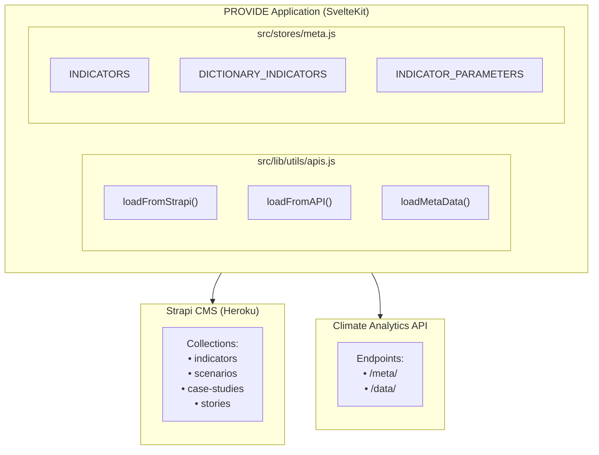

### ixmp4-ts Library Structure

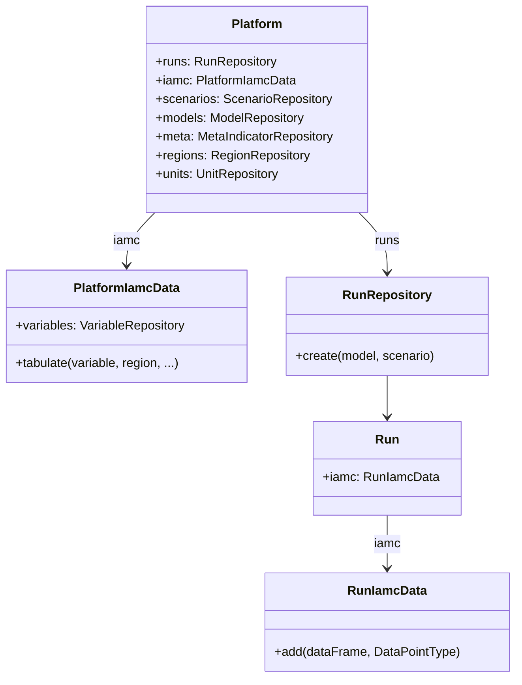

**Key Methods:**
- `platform.iamc.tabulate({ variable, region, ... })` - Time series queries
- `run.iamc.add(dataFrame, DataPointType.ANNUAL)` - Add data points
- `platform.regions.create({ name })` - Create regions
- `platform.units.create({ name })` - Create units

---

## Proposed Solution: Hybrid Architecture

Since ixmp4 lacks native metadata support, we use a **hybrid approach**:
- **Strapi CMS** → Rich metadata (categories, tags, descriptions)
- **ixmp4** → Time series data (region, year, value)
- **Link field** → `ixmp4Variable` connects the two systems

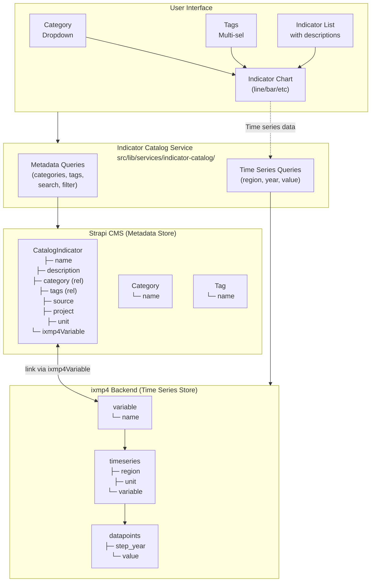

---

## Data Model

### Strapi Content Types

#### CatalogIndicator

| Field | Type | Description | Required |
|-------|------|-------------|----------|
| name | Text | Human-readable indicator name | ✓ |
| description | Rich Text | Detailed description with markdown support | |
| category | Relation → Category | Many-to-one relationship | |
| tags | Relation → Tag | Many-to-many relationship | |
| source | Text | Data source (e.g., "IIASA") | |
| project | Text | Project name (e.g., "Climate Pathways") | |
| unit | Text | Measurement unit (e.g., "days/year") | ✓ |
| ixmp4Variable | Text | **Link to ixmp4 variable name** | ✓ (unique) |

#### Category

| Field | Type | Description | Required |
|-------|------|-------------|----------|
| name | Text | Category name (e.g., "Climate", "Energy") | ✓ (unique) |
| indicators | Relation → CatalogIndicator | One-to-many (inverse) | |

#### Tag

| Field | Type | Description | Required |
|-------|------|-------------|----------|
| name | Text | Tag name (e.g., "temperature", "health") | ✓ (unique) |
| indicators | Relation → CatalogIndicator | Many-to-many (inverse) | |

### ixmp4 Data Structure

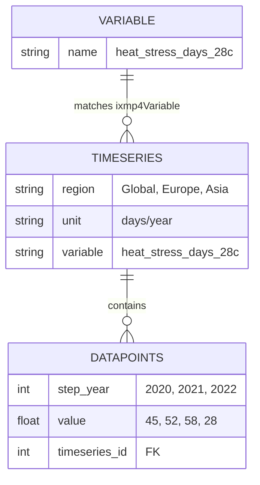

**Example Data:**

| region | unit | variable |
|--------|------|----------|
| Global | days/year | heat_stress_days_28c |
| Europe | days/year | heat_stress_days_28c |
| Asia | days/year | heat_stress_days_28c |

| step_year | value | timeseries_id |
|-----------|-------|---------------|
| 2020 | 45 | 1 |
| 2021 | 52 | 1 |
| 2022 | 58 | 1 |
| 2020 | 28 | 2 (Europe) |

---

## The Link: ixmp4Variable

The `ixmp4Variable` field bridges the two databases:

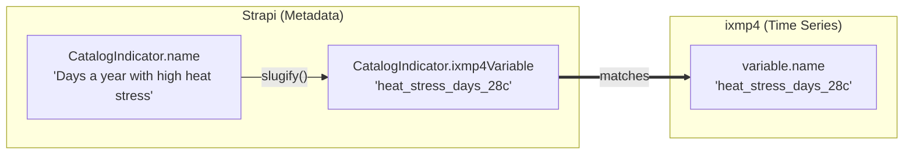

### Slug Generation Rules

1. Convert to lowercase
2. Normalize unicode (remove diacritics)
3. Convert subscript/superscript numbers (CO₂ → co2)
4. Remove special characters except alphanumeric
5. Replace spaces/hyphens with underscores
6. Collapse multiple underscores
7. Ensure uniqueness (append counter if needed)

**Examples:**
| Input | Output |
|-------|--------|
| "Days a year with high heat stress" | `days_a_year_with_high_heat_stress` |
| "CO₂ Emissions (Mt/year)" | `co2_emissions_mt_year` |
| "Global Mean Temperature Δ" | `global_mean_temperature` |

---

## File Structure

```
provide/src/lib/services/indicator-catalog/
├── index.ts                 # Main exports
├── types.ts                 # TypeScript type definitions
├── strapi-client.ts         # Strapi API client for metadata
├── ixmp4-client.ts          # ixmp4-ts wrapper for time series
├── indicator-service.ts     # Main service combining both
├── upload-service.ts        # Handles indicator upload flow
└── utils.ts                 # Slug generation, CSV parsing
```

---

## API Design

### Query Methods

#### Get Categories (for dropdown)

```typescript
async function getCategories(): Promise<string[]>
```

**Flow:**
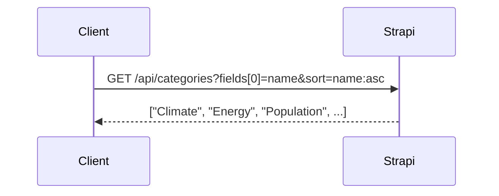

#### Get Tags (for multi-select)

```typescript
async function getTags(): Promise<string[]>
```

**Flow:**
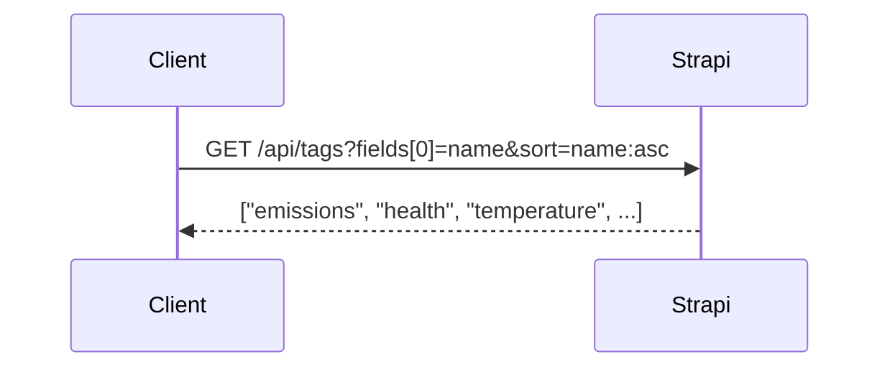

#### Get Indicators (filtered list)

```typescript
async function getIndicators(filter?: {
  category?: string;
  tags?: string[];
  search?: string;
}): Promise<IndicatorMetadata[]>
```

**Flow:**
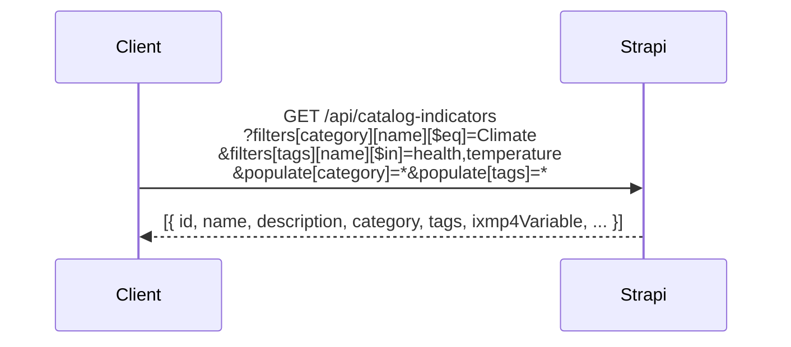

#### Get Time Series (for charts)

```typescript
async function getTimeSeries(
  ixmp4Variable: string,
  filter?: { region?: string; yearStart?: number; yearEnd?: number }
): Promise<TimeSeriesData>
```

**Flow:**
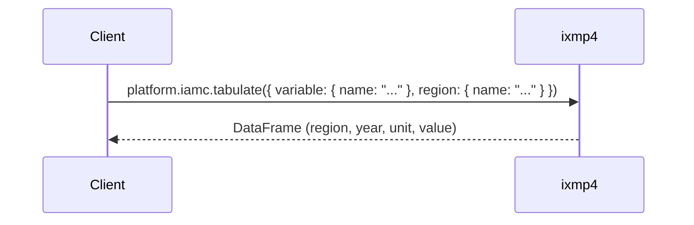

---

## Upload Flow

### Sequence Diagram

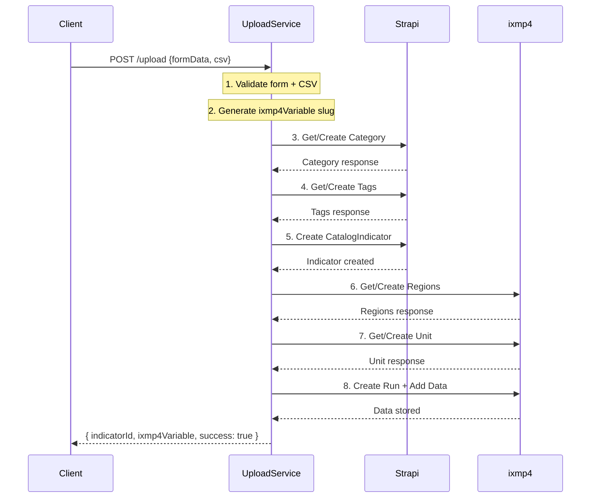

### Upload Form UI

```
┌─────────────────────────────────────────────────────────────────┐
│                    Upload Indicator Page                         │
├─────────────────────────────────────────────────────────────────┤
│                                                                  │
│   ┌─────────────────────────────────────────────────────────┐   │
│   │  FORM FIELDS (metadata → Strapi)                         │   │
│   ├─────────────────────────────────────────────────────────┤   │
│   │  Name:        [Days a year with high heat stress    ]   │   │
│   │  Description: [Number of days per year where WBGT...]   │   │
│   │  Category:    [Climate                          ▼]      │   │
│   │  Tags:        [temperature] [health] [heat] [+]         │   │
│   │  Source:      [IIASA                               ]    │   │
│   │  Project:     [Climate Pathways                    ]    │   │
│   │  Unit:        [days/year                           ]    │   │
│   └─────────────────────────────────────────────────────────┘   │
│                                                                  │
│   ┌─────────────────────────────────────────────────────────┐   │
│   │  CSV FILE (time series → ixmp4)                          │   │
│   ├─────────────────────────────────────────────────────────┤   │
│   │  [Choose File...]  heat_stress_data.csv                  │   │
│   │                                                          │   │
│   │  Expected format:                                        │   │
│   │  ┌────────────┬────────┬─────────┐                       │   │
│   │  │ region     │ year   │ value   │                       │   │
│   │  ├────────────┼────────┼─────────┤                       │   │
│   │  │ Global     │ 2020   │ 45      │                       │   │
│   │  │ Global     │ 2021   │ 52      │                       │   │
│   │  │ Europe     │ 2020   │ 28      │                       │   │
│   │  └────────────┴────────┴─────────┘                       │   │
│   └─────────────────────────────────────────────────────────┘   │
│                                                                  │
│                    [ Upload Indicator ]                          │
│                                                                  │
└─────────────────────────────────────────────────────────────────┘
```

---

## Query Flow Examples

### Example 1: Populate Category Dropdown

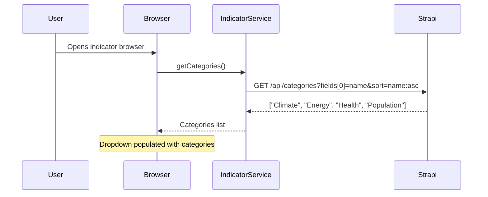

### Example 2: Filter by Category + Tags

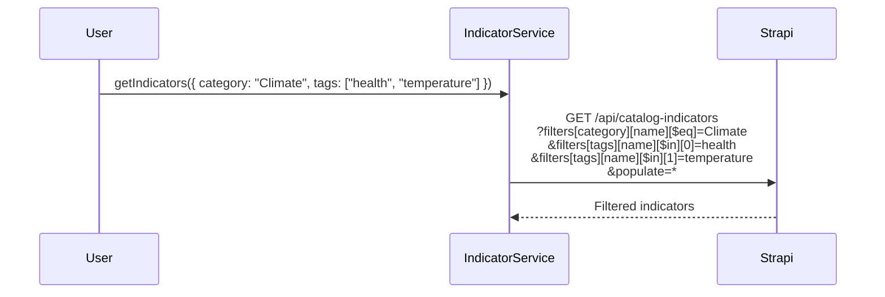

**Result:**

| name | ixmp4Variable |
|------|---------------|
| Days with high heat stress | heat_stress_days_28c |
| Heat-related mortality risk | heat_mortality_risk |

### Example 3: Fetch Time Series for Chart

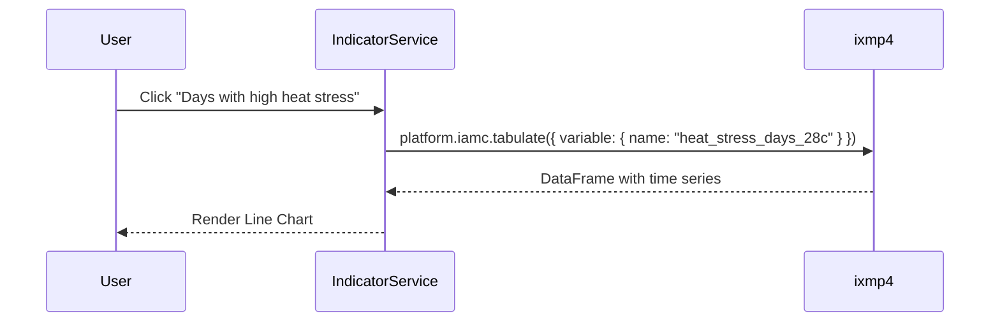

**Result (DataFrame):**

| region | year | unit | value |
|--------|------|------|-------|
| Global | 2020 | days/year | 45 |
| Global | 2021 | days/year | 52 |
| Global | 2022 | days/year | 58 |
| Europe | 2020 | days/year | 28 |
| Europe | 2021 | days/year | 31 |

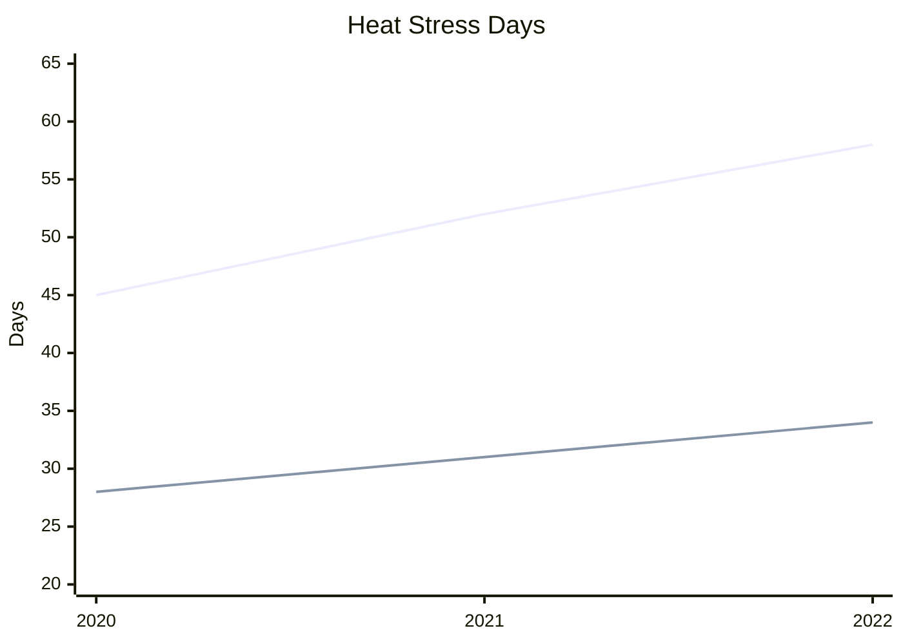

---

## Error Handling Strategy

### Transaction Flow with Rollback

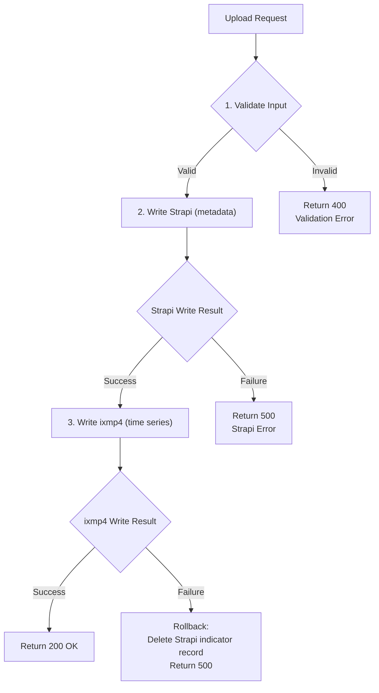

### Error Types

| Error | HTTP Code | User Message |
|-------|-----------|--------------|
| Missing required fields | 400 | "Name and unit are required" |
| Invalid CSV format | 400 | "CSV must have region, year, value columns" |
| Duplicate indicator | 409 | "An indicator with this name already exists" |
| Strapi unavailable | 503 | "Metadata service temporarily unavailable" |
| ixmp4 unavailable | 503 | "Time series service temporarily unavailable" |
| Partial failure | 500 | "Upload partially failed, please retry" |

---

## Integration with Existing Code

### Strapi Client (extend existing apis.js)

The existing `loadFromStrapi()` function in `src/lib/utils/apis.js` can be extended:

```javascript
// Existing function signature
loadFromStrapi(path, fetch, populate = 'populate=*', qs)

// Usage for indicator catalog:
loadFromStrapi('catalog-indicators', fetch, 'populate=category,tags',
  'filters[category][name][$eq]=Climate')
```

### ixmp4-ts Integration

```javascript
import { Platform, DataFrame, DataPointType } from 'ixmp4-ts';

// Initialize platform (needs auth configuration)
const platform = await Platform.create({
  name: 'indicators',
  baseUrl: import.meta.env.VITE_IXMP4_URL,
  auth: { /* JWT auth config */ }
});

// Query time series
const data = await platform.iamc.tabulate({
  variable: { name: 'heat_stress_days_28c' }
});

// Upload time series
const run = await platform.runs.create('Indicators', 'main');
await run.iamc.add(dataFrame, DataPointType.ANNUAL);
```

---

## Strapi Content Type Setup

### Using Strapi Admin UI

1. Navigate to Content-Type Builder
2. Create new Collection Type: **CatalogIndicator**
3. Add fields as specified in Data Model section
4. Create **Category** and **Tag** collection types
5. Set up relations between types
6. Configure API permissions for public/authenticated access

### Alternative: Schema JSON

```json
// catalog-indicator.json
{
  "kind": "collectionType",
  "collectionName": "catalog_indicators",
  "info": {
    "singularName": "catalog-indicator",
    "pluralName": "catalog-indicators",
    "displayName": "Catalog Indicator"
  },
  "attributes": {
    "name": { "type": "string", "required": true },
    "description": { "type": "richtext" },
    "source": { "type": "string" },
    "project": { "type": "string" },
    "unit": { "type": "string", "required": true },
    "ixmp4Variable": { "type": "string", "required": true, "unique": true },
    "category": {
      "type": "relation",
      "relation": "manyToOne",
      "target": "api::category.category",
      "inversedBy": "indicators"
    },
    "tags": {
      "type": "relation",
      "relation": "manyToMany",
      "target": "api::tag.tag",
      "inversedBy": "indicators"
    }
  }
}
```

---

## Environment Variables

Add to `.env`:

```bash
# Existing
VITE_HEROKU_URL=https://your-strapi-instance.herokuapp.com

# New for ixmp4
VITE_IXMP4_URL=https://ixmp.ece.iiasa.ac.at
VITE_IXMP4_PLATFORM=indicators
```

---

## Testing Strategy

### Unit Tests

| Component | Test Cases |
|-----------|------------|
| slugify() | Unicode handling, special chars, uniqueness |
| parseCSV() | Valid CSV, missing columns, invalid values |
| validateIndicatorData() | Required fields, format validation |

### Integration Tests

| Flow | Test Cases |
|------|------------|
| getCategories() | Returns sorted list from Strapi |
| getIndicators(filter) | Category filter, tag filter, combined |
| getTimeSeries() | Variable exists, variable not found |
| uploadIndicator() | Success path, validation failure, rollback |

### E2E Tests

1. Upload new indicator with CSV
2. Browse indicators by category
3. Filter by multiple tags
4. View time series chart
5. Error handling for network failures

---

## Migration Considerations

### Existing Indicators

The current system has indicators in Strapi with `UID` field. Migration path:

1. Create new `CatalogIndicator` content type (don't modify existing `Indicator`)
2. Gradually migrate indicators that need rich metadata + time series
3. Keep existing `Indicator` type for backward compatibility

### Data Migration Script

```
For each existing indicator:
  1. Create CatalogIndicator in Strapi with:
     - Copy name, description
     - Generate ixmp4Variable from UID or name
     - Assign category based on existing grouping
     - Add relevant tags

  2. If time series data exists elsewhere:
     - Parse into DataFrame format
     - Upload to ixmp4 via run.iamc.add()
```

---

## Summary

| Requirement | Solution | Query Support |
|-------------|----------|---------------|
| Name | Strapi `CatalogIndicator.name` | Full-text search |
| Description | Strapi `CatalogIndicator.description` | Full-text search |
| Category | Strapi relation to `Category` | Exact/dropdown filter |
| Tags | Strapi relation to `Tag` (many-to-many) | Multi-select filter |
| Source | Strapi `CatalogIndicator.source` | Filter/display |
| Project | Strapi `CatalogIndicator.project` | Filter/display |
| Unit | Strapi + ixmp4 | Display |
| Time Series | ixmp4 via `ixmp4Variable` link | Fetch by variable name |

This hybrid architecture leverages existing infrastructure (Strapi for CMS, ixmp4-ts for time series) while providing the rich metadata and query capabilities needed for an indicator catalog.
