# Indicator Catalog Technical Design (SQLite + Drizzle)

## Overview

This document outlines the technical design for implementing a data catalog for climate/environmental indicators within the IIASA PROVIDE application using **SQLite with Drizzle ORM** for metadata storage.

### Goals
- Rich metadata support (name, description, category, tags, source, project, unit)
- Time series data storage (region, year, value)
- Query capabilities for UI dropdowns/menus (filter by category, tags)
- Self-contained metadata storage (no external CMS dependency)
- Integration with ixmp4-ts for time series data

### Constraint
Must use **ixmp4-ts** for time series storage, which lacks native support for categories, tags, and rich metadata on variables.

---

## Proposed Solution: Hybrid Architecture

Since ixmp4 lacks native metadata support, we use a **hybrid approach**:
- **SQLite + Drizzle** → Rich metadata (categories, tags, descriptions)
- **ixmp4** → Time series data (region, year, value)
- **Link field** → `ixmp4Variable` connects the two systems

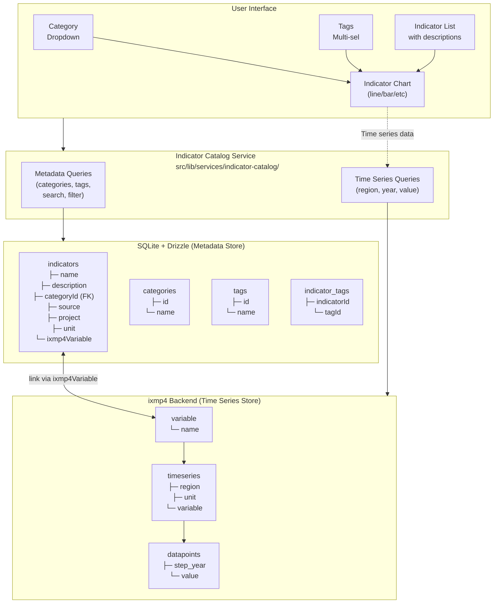

---

## Data Model

### Entity Relationship Diagram

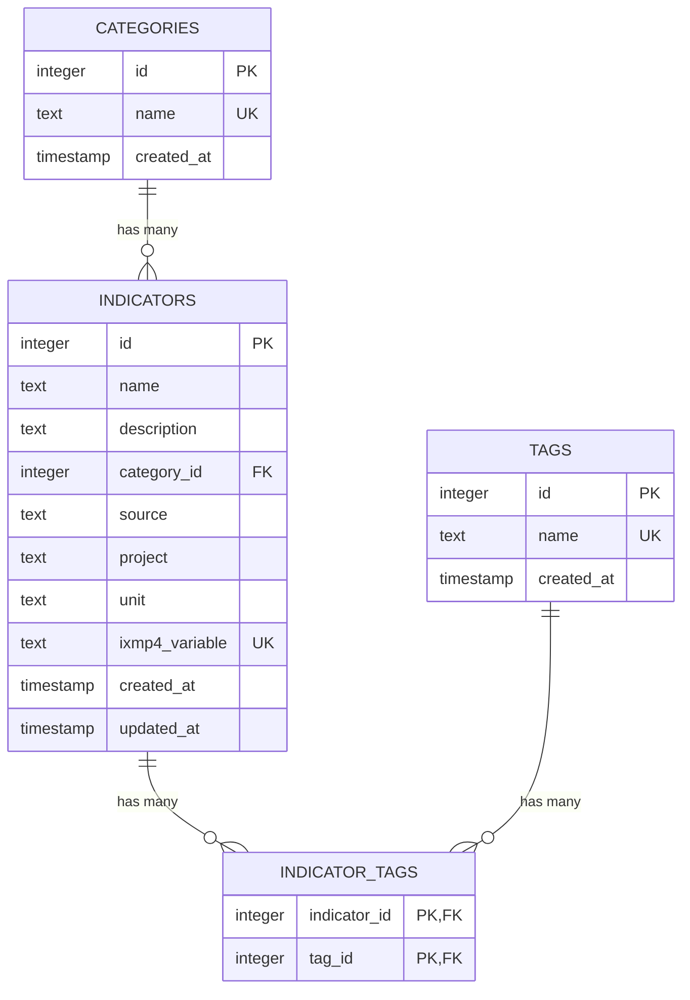

### Table Definitions

#### indicators

| Field | Type | Description | Required |
|-------|------|-------------|----------|
| id | Integer | Primary key, auto-increment | ✓ |
| name | Text | Human-readable indicator name | ✓ |
| description | Text | Detailed description with markdown support | |
| category_id | Integer | Foreign key to categories | |
| source | Text | Data source (e.g., "IIASA") | |
| project | Text | Project name (e.g., "Climate Pathways") | |
| unit | Text | Measurement unit (e.g., "days/year") | ✓ |
| ixmp4_variable | Text | **Link to ixmp4 variable name** | ✓ (unique) |
| created_at | Timestamp | Record creation time | ✓ |
| updated_at | Timestamp | Last update time | ✓ |

#### categories

| Field | Type | Description | Required |
|-------|------|-------------|----------|
| id | Integer | Primary key, auto-increment | ✓ |
| name | Text | Category name (e.g., "Climate", "Energy") | ✓ (unique) |
| created_at | Timestamp | Record creation time | ✓ |

#### tags

| Field | Type | Description | Required |
|-------|------|-------------|----------|
| id | Integer | Primary key, auto-increment | ✓ |
| name | Text | Tag name (e.g., "temperature", "health") | ✓ (unique) |
| created_at | Timestamp | Record creation time | ✓ |

#### indicator_tags (Junction Table)

| Field | Type | Description | Required |
|-------|------|-------------|----------|
| indicator_id | Integer | Foreign key to indicators | ✓ (PK) |
| tag_id | Integer | Foreign key to tags | ✓ (PK) |

---

## API Design

### Endpoints

| Method | Endpoint | Description |
|--------|----------|-------------|
| GET | `/api/categories` | List all categories |
| GET | `/api/tags` | List all tags |
| GET | `/api/indicators` | List indicators (with optional filters) |
| GET | `/api/indicators/:variable` | Get single indicator by ixmp4Variable |
| GET | `/api/indicators/:variable/timeseries` | Get time series data |
| POST | `/api/indicators/upload` | Upload new indicator with CSV |

### Query Methods

#### Get Categories (for dropdown)

```typescript
async function getCategories(): Promise<string[]>
```

**Flow:**
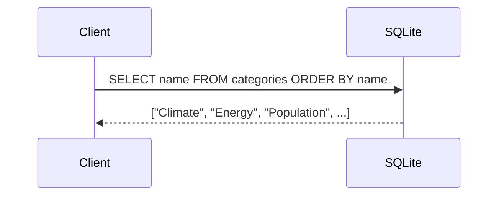

#### Get Tags (for multi-select)

```typescript
async function getTags(): Promise<string[]>
```

**Flow:**
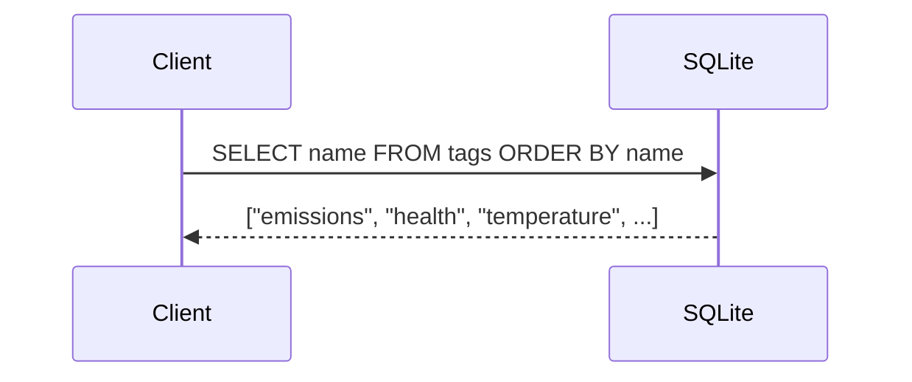

#### Get Indicators (filtered list)

```typescript
async function getIndicators(filter?: {
  category?: string;
  tags?: string[];
  search?: string;
}): Promise<IndicatorMetadata[]>
```

**Flow:**
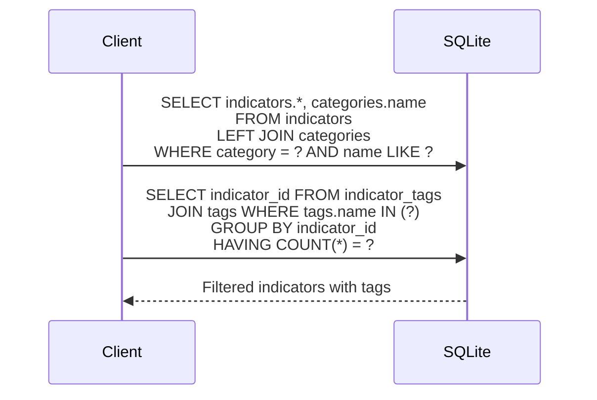

#### Get Time Series (for charts)

```typescript
async function getTimeSeries(
  ixmp4Variable: string,
  filter?: { region?: string; yearStart?: number; yearEnd?: number }
): Promise<TimeSeriesData>
```

**Flow:**
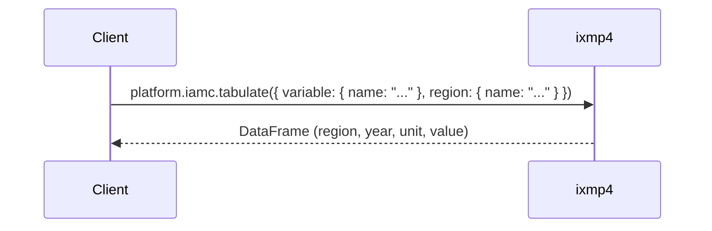

---

## Upload Flow

### Sequence Diagram

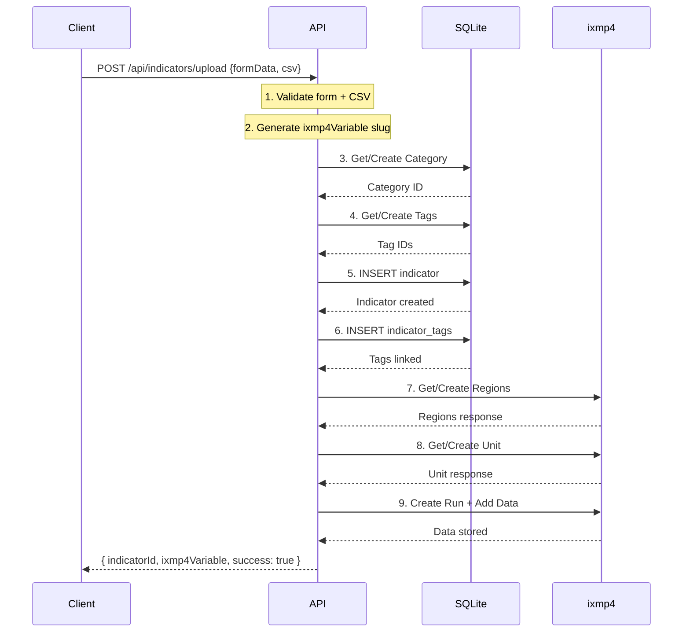

### Upload Form UI

```
┌─────────────────────────────────────────────────────────────────┐
│                    Upload Indicator Page                         │
├─────────────────────────────────────────────────────────────────┤
│                                                                  │
│   ┌─────────────────────────────────────────────────────────┐   │
│   │  FORM FIELDS (metadata → SQLite)                         │   │
│   ├─────────────────────────────────────────────────────────┤   │
│   │  Name:        [Days a year with high heat stress    ]   │   │
│   │  Description: [Number of days per year where WBGT...]   │   │
│   │  Category:    [Climate                          ▼]      │   │
│   │  Tags:        [temperature] [health] [heat] [+]         │   │
│   │  Source:      [IIASA                               ]    │   │
│   │  Project:     [Climate Pathways                    ]    │   │
│   │  Unit:        [days/year                           ]    │   │
│   └─────────────────────────────────────────────────────────┘   │
│                                                                  │
│   ┌─────────────────────────────────────────────────────────┐   │
│   │  CSV FILE (time series → ixmp4)                          │   │
│   ├─────────────────────────────────────────────────────────┤   │
│   │  [Choose File...]  heat_stress_data.csv                  │   │
│   │                                                          │   │
│   │  Expected format:                                        │   │
│   │  ┌────────────┬────────┬─────────┐                       │   │
│   │  │ region     │ year   │ value   │                       │   │
│   │  ├────────────┼────────┼─────────┤                       │   │
│   │  │ Global     │ 2020   │ 45      │                       │   │
│   │  │ Global     │ 2021   │ 52      │                       │   │
│   │  │ Europe     │ 2020   │ 28      │                       │   │
│   │  └────────────┴────────┴─────────┘                       │   │
│   └─────────────────────────────────────────────────────────┘   │
│                                                                  │
│                    [ Upload Indicator ]                          │
│                                                                  │
└─────────────────────────────────────────────────────────────────┘
```

---

## Query Flow Examples

### Example 1: Populate Category Dropdown

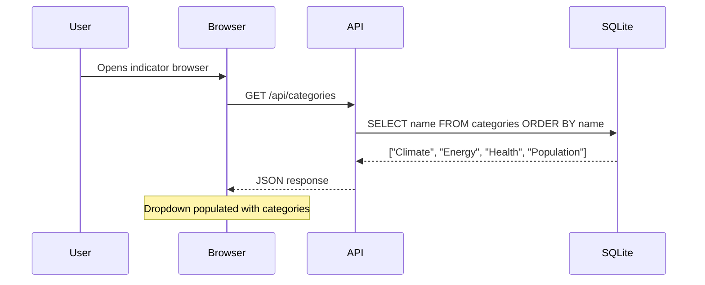

### Example 2: Filter by Category + Tags

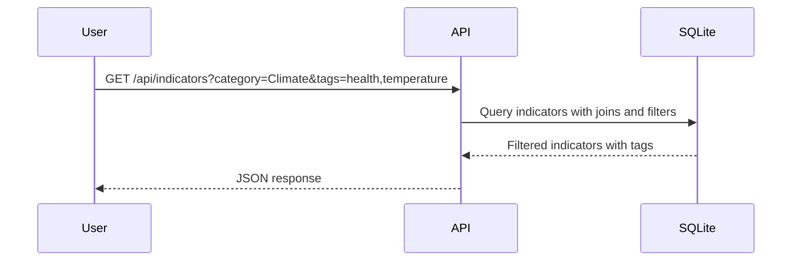

**Result:**

| name | ixmp4Variable |
|------|---------------|
| Days with high heat stress | heat_stress_days_28c |
| Heat-related mortality risk | heat_mortality_risk |

### Example 3: Fetch Time Series for Chart

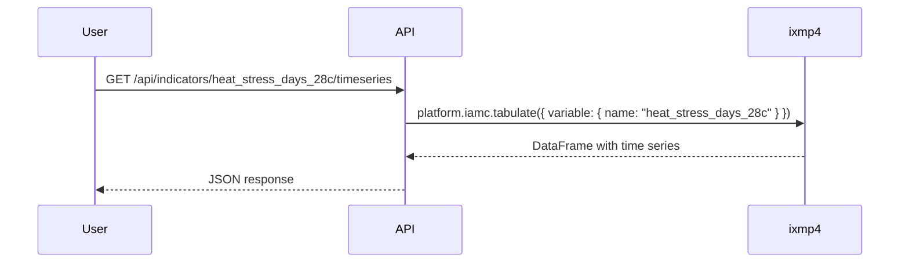

**Result (DataFrame):**

| region | year | unit | value |
|--------|------|------|-------|
| Global | 2020 | days/year | 45 |
| Global | 2021 | days/year | 52 |
| Global | 2022 | days/year | 58 |
| Europe | 2020 | days/year | 28 |
| Europe | 2021 | days/year | 31 |

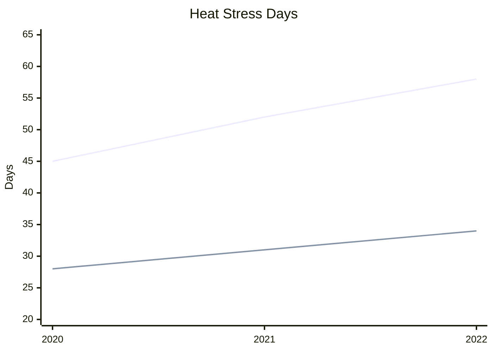

---

## Error Handling Strategy

### Transaction Flow with Rollback

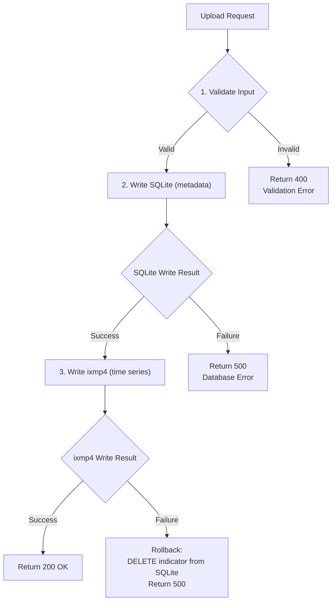

### Error Types

| Error | HTTP Code | User Message |
|-------|-----------|--------------|
| Missing required fields | 400 | "Name and unit are required" |
| Invalid CSV format | 400 | "CSV must have region, year, value columns" |
| Duplicate indicator | 409 | "An indicator with this name already exists" |
| Database unavailable | 503 | "Metadata service temporarily unavailable" |
| ixmp4 unavailable | 503 | "Time series service temporarily unavailable" |
| Partial failure | 500 | "Upload partially failed, please retry" |

---

## Dependencies

| Package | Purpose |
|---------|---------|
| drizzle-orm | Type-safe ORM for SQLite |
| better-sqlite3 | SQLite driver for Node.js |
| drizzle-kit | Migration generation and Drizzle Studio |

---

## Comparison: Strapi vs SQLite + Drizzle

| Aspect | Strapi | SQLite + Drizzle |
|--------|--------|------------------|
| **Deployment** | Separate service (Heroku) | Embedded in app |
| **Admin UI** | Built-in CMS | Drizzle Studio or custom |
| **Scalability** | Horizontal | Vertical (single file) |
| **Complexity** | Higher (external dependency) | Lower (self-contained) |
| **Query Performance** | Network latency | Local, very fast |
| **Schema Changes** | Through Strapi admin | Code-first migrations |
| **Type Safety** | Manual types | Full TypeScript inference |
| **Cost** | Heroku hosting | Free (file-based) |
| **Backup** | Database backup | Copy single file |
| **Best For** | Multi-user CMS, content editors | Developer-managed data |

---

## Migration from Strapi

If migrating from the Strapi-based design:

1. Export existing data from Strapi (categories, tags, indicators)
2. Run migration script to insert into SQLite
3. Verify data integrity
4. Update API endpoints to use new service
5. Remove Strapi dependencies

The migration preserves all relationships and the `ixmp4Variable` links, ensuring time series data in ixmp4 remains accessible.

---

## Summary

| Requirement | Solution | Query Support |
|-------------|----------|---------------|
| Name | SQLite `indicators.name` | Full-text search (LIKE) |
| Description | SQLite `indicators.description` | Full-text search (LIKE) |
| Category | SQLite FK to `categories` | Exact/dropdown filter |
| Tags | SQLite junction table `indicator_tags` | Multi-select filter |
| Source | SQLite `indicators.source` | Filter/display |
| Project | SQLite `indicators.project` | Filter/display |
| Unit | SQLite + ixmp4 | Display |
| Time Series | ixmp4 via `ixmp4Variable` link | Fetch by variable name |

This architecture provides a self-contained, type-safe solution using SQLite with Drizzle ORM for metadata storage while leveraging ixmp4-ts for time series data.
