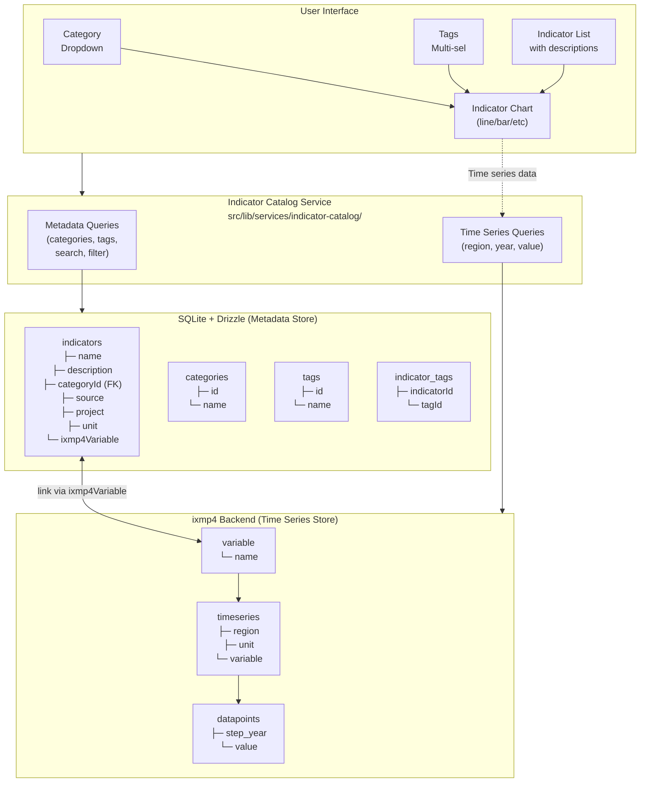
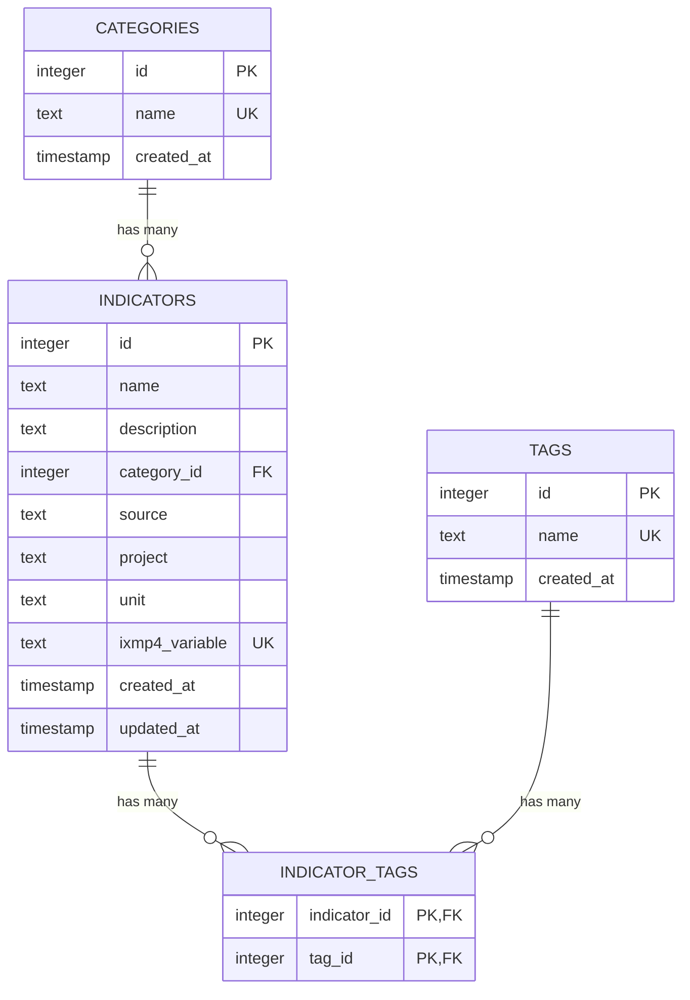
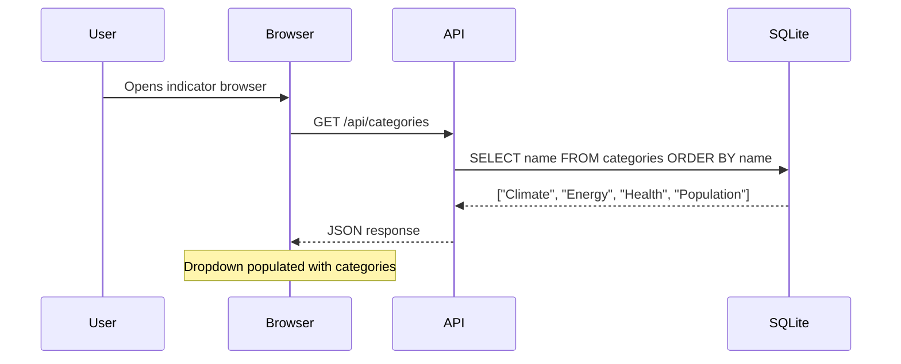
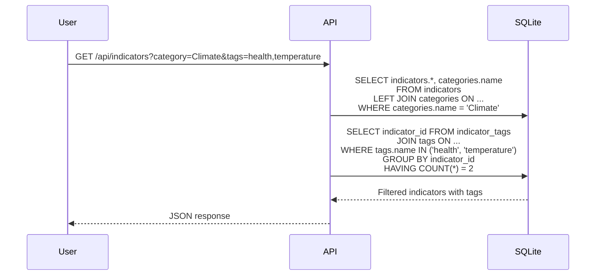
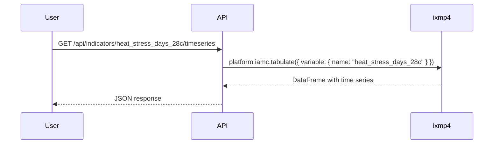
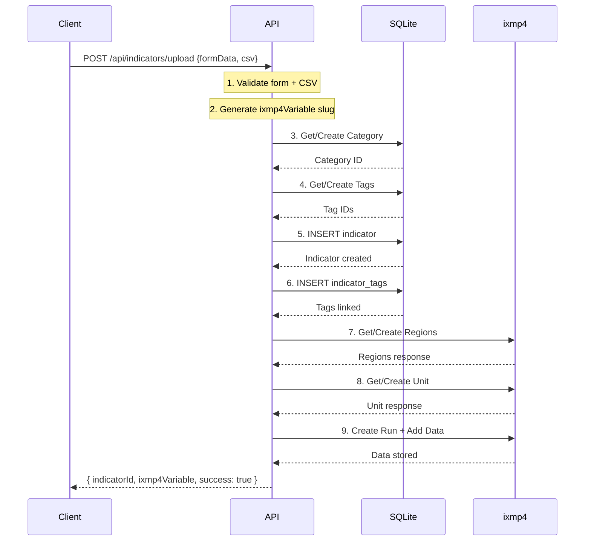
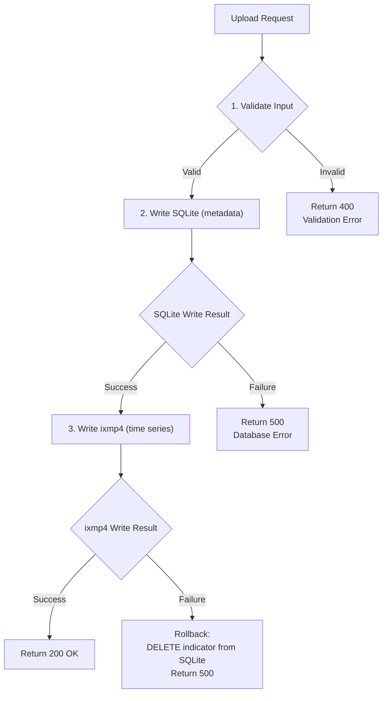

# Indicator Catalog Technical Design (SQLite + Drizzle)

## Overview

This document outlines the technical design for implementing a data catalog for climate/environmental indicators within the IIASA PROVIDE application using **SQLite with Drizzle ORM** for metadata storage.

### Goals
- Rich metadata support (name, description, category, tags, source, project, unit)
- Time series data storage (region, year, value)
- Query capabilities for UI dropdowns/menus (filter by category, tags)
- Self-contained metadata storage (no external CMS dependency)
- Integration with ixmp4-ts for time series data

### Constraint
Must use **ixmp4-ts** for time series storage, which lacks native support for categories, tags, and rich metadata on variables.

---

## Proposed Solution: Hybrid Architecture

Since ixmp4 lacks native metadata support, we use a **hybrid approach**:
- **SQLite + Drizzle** → Rich metadata (categories, tags, descriptions)
- **ixmp4** → Time series data (region, year, value)
- **Link field** → `ixmp4Variable` connects the two systems



---

## Data Model

### Drizzle Schema

#### File: `src/lib/db/schema.ts`

```typescript
import { sqliteTable, text, integer, primaryKey } from 'drizzle-orm/sqlite-core';
import { relations } from 'drizzle-orm';

// Categories table
export const categories = sqliteTable('categories', {
  id: integer('id').primaryKey({ autoIncrement: true }),
  name: text('name').notNull().unique(),
  createdAt: integer('created_at', { mode: 'timestamp' }).$defaultFn(() => new Date()),
});

// Tags table
export const tags = sqliteTable('tags', {
  id: integer('id').primaryKey({ autoIncrement: true }),
  name: text('name').notNull().unique(),
  createdAt: integer('created_at', { mode: 'timestamp' }).$defaultFn(() => new Date()),
});

// Indicators table
export const indicators = sqliteTable('indicators', {
  id: integer('id').primaryKey({ autoIncrement: true }),
  name: text('name').notNull(),
  description: text('description'),
  categoryId: integer('category_id').references(() => categories.id),
  source: text('source'),
  project: text('project'),
  unit: text('unit').notNull(),
  ixmp4Variable: text('ixmp4_variable').notNull().unique(),
  createdAt: integer('created_at', { mode: 'timestamp' }).$defaultFn(() => new Date()),
  updatedAt: integer('updated_at', { mode: 'timestamp' }).$defaultFn(() => new Date()),
});

// Junction table for many-to-many indicator <-> tags relationship
export const indicatorTags = sqliteTable('indicator_tags', {
  indicatorId: integer('indicator_id').notNull().references(() => indicators.id, { onDelete: 'cascade' }),
  tagId: integer('tag_id').notNull().references(() => tags.id, { onDelete: 'cascade' }),
}, (table) => ({
  pk: primaryKey({ columns: [table.indicatorId, table.tagId] }),
}));

// Relations
export const categoriesRelations = relations(categories, ({ many }) => ({
  indicators: many(indicators),
}));

export const tagsRelations = relations(tags, ({ many }) => ({
  indicatorTags: many(indicatorTags),
}));

export const indicatorsRelations = relations(indicators, ({ one, many }) => ({
  category: one(categories, {
    fields: [indicators.categoryId],
    references: [categories.id],
  }),
  indicatorTags: many(indicatorTags),
}));

export const indicatorTagsRelations = relations(indicatorTags, ({ one }) => ({
  indicator: one(indicators, {
    fields: [indicatorTags.indicatorId],
    references: [indicators.id],
  }),
  tag: one(tags, {
    fields: [indicatorTags.tagId],
    references: [tags.id],
  }),
}));
```

### Entity Relationship Diagram



### TypeScript Types

#### File: `src/lib/db/types.ts`

```typescript
import type { InferSelectModel, InferInsertModel } from 'drizzle-orm';
import type { categories, tags, indicators, indicatorTags } from './schema';

// Select types (for reading)
export type Category = InferSelectModel<typeof categories>;
export type Tag = InferSelectModel<typeof tags>;
export type Indicator = InferSelectModel<typeof indicators>;
export type IndicatorTag = InferSelectModel<typeof indicatorTags>;

// Insert types (for creating)
export type NewCategory = InferInsertModel<typeof categories>;
export type NewTag = InferInsertModel<typeof tags>;
export type NewIndicator = InferInsertModel<typeof indicators>;
export type NewIndicatorTag = InferInsertModel<typeof indicatorTags>;

// Extended types with relations
export type IndicatorWithRelations = Indicator & {
  category: Category | null;
  tags: Tag[];
};

export type IndicatorMetadata = {
  id: number;
  name: string;
  description: string | null;
  category: string | null;
  tags: string[];
  source: string | null;
  project: string | null;
  unit: string;
  ixmp4Variable: string;
};
```

---

## Database Setup

### File: `src/lib/db/index.ts`

```typescript
import { drizzle } from 'drizzle-orm/better-sqlite3';
import Database from 'better-sqlite3';
import * as schema from './schema';

const sqlite = new Database('indicators.db');
export const db = drizzle(sqlite, { schema });

// Enable foreign keys
sqlite.pragma('foreign_keys = ON');
```

### File: `src/lib/db/migrate.ts`

```typescript
import { migrate } from 'drizzle-orm/better-sqlite3/migrator';
import { db } from './index';

// Run migrations
migrate(db, { migrationsFolder: './drizzle' });
```

### Drizzle Config: `drizzle.config.ts`

```typescript
import type { Config } from 'drizzle-kit';

export default {
  schema: './src/lib/db/schema.ts',
  out: './drizzle',
  driver: 'better-sqlite3',
  dbCredentials: {
    url: './indicators.db',
  },
} satisfies Config;
```

---

## API Design

### Repository Layer

#### File: `src/lib/db/repositories/category-repository.ts`

```typescript
import { eq, asc } from 'drizzle-orm';
import { db } from '../index';
import { categories } from '../schema';
import type { Category, NewCategory } from '../types';

export const categoryRepository = {
  async getAll(): Promise<Category[]> {
    return db.select().from(categories).orderBy(asc(categories.name));
  },

  async getByName(name: string): Promise<Category | undefined> {
    const result = await db.select().from(categories).where(eq(categories.name, name));
    return result[0];
  },

  async create(data: NewCategory): Promise<Category> {
    const result = await db.insert(categories).values(data).returning();
    return result[0];
  },

  async getOrCreate(name: string): Promise<Category> {
    const existing = await this.getByName(name);
    if (existing) return existing;
    return this.create({ name });
  },
};
```

#### File: `src/lib/db/repositories/tag-repository.ts`

```typescript
import { eq, asc, inArray } from 'drizzle-orm';
import { db } from '../index';
import { tags } from '../schema';
import type { Tag, NewTag } from '../types';

export const tagRepository = {
  async getAll(): Promise<Tag[]> {
    return db.select().from(tags).orderBy(asc(tags.name));
  },

  async getByName(name: string): Promise<Tag | undefined> {
    const result = await db.select().from(tags).where(eq(tags.name, name));
    return result[0];
  },

  async getByNames(names: string[]): Promise<Tag[]> {
    if (names.length === 0) return [];
    return db.select().from(tags).where(inArray(tags.name, names));
  },

  async create(data: NewTag): Promise<Tag> {
    const result = await db.insert(tags).values(data).returning();
    return result[0];
  },

  async getOrCreate(name: string): Promise<Tag> {
    const existing = await this.getByName(name);
    if (existing) return existing;
    return this.create({ name });
  },

  async getOrCreateMany(names: string[]): Promise<Tag[]> {
    return Promise.all(names.map(name => this.getOrCreate(name)));
  },
};
```

#### File: `src/lib/db/repositories/indicator-repository.ts`

```typescript
import { eq, like, and, inArray, sql } from 'drizzle-orm';
import { db } from '../index';
import { indicators, categories, tags, indicatorTags } from '../schema';
import type { Indicator, NewIndicator, IndicatorMetadata } from '../types';

export type IndicatorFilter = {
  category?: string;
  tags?: string[];
  search?: string;
};

export const indicatorRepository = {
  async getAll(): Promise<IndicatorMetadata[]> {
    return this.getFiltered({});
  },

  async getFiltered(filter: IndicatorFilter): Promise<IndicatorMetadata[]> {
    // Build the query with joins
    const query = db
      .select({
        id: indicators.id,
        name: indicators.name,
        description: indicators.description,
        category: categories.name,
        source: indicators.source,
        project: indicators.project,
        unit: indicators.unit,
        ixmp4Variable: indicators.ixmp4Variable,
      })
      .from(indicators)
      .leftJoin(categories, eq(indicators.categoryId, categories.id));

    // Build conditions
    const conditions = [];

    if (filter.category) {
      conditions.push(eq(categories.name, filter.category));
    }

    if (filter.search) {
      conditions.push(
        sql`(${indicators.name} LIKE ${`%${filter.search}%`} OR ${indicators.description} LIKE ${`%${filter.search}%`})`
      );
    }

    // Execute main query
    const baseResults = conditions.length > 0
      ? await query.where(and(...conditions))
      : await query;

    // If tag filter exists, filter by tags
    let filteredIds = baseResults.map(r => r.id);

    if (filter.tags && filter.tags.length > 0) {
      const indicatorsWithTags = await db
        .select({ indicatorId: indicatorTags.indicatorId })
        .from(indicatorTags)
        .innerJoin(tags, eq(indicatorTags.tagId, tags.id))
        .where(inArray(tags.name, filter.tags))
        .groupBy(indicatorTags.indicatorId)
        .having(sql`COUNT(DISTINCT ${tags.name}) = ${filter.tags.length}`);

      const tagFilteredIds = new Set(indicatorsWithTags.map(r => r.indicatorId));
      filteredIds = filteredIds.filter(id => tagFilteredIds.has(id));
    }

    // Fetch tags for each indicator
    const indicatorIds = filteredIds;
    const allTags = indicatorIds.length > 0
      ? await db
          .select({
            indicatorId: indicatorTags.indicatorId,
            tagName: tags.name,
          })
          .from(indicatorTags)
          .innerJoin(tags, eq(indicatorTags.tagId, tags.id))
          .where(inArray(indicatorTags.indicatorId, indicatorIds))
      : [];

    // Group tags by indicator
    const tagsByIndicator = new Map<number, string[]>();
    for (const row of allTags) {
      const existing = tagsByIndicator.get(row.indicatorId) || [];
      existing.push(row.tagName);
      tagsByIndicator.set(row.indicatorId, existing);
    }

    // Combine results
    return baseResults
      .filter(r => filteredIds.includes(r.id))
      .map(r => ({
        ...r,
        tags: tagsByIndicator.get(r.id) || [],
      }));
  },

  async getByIxmp4Variable(ixmp4Variable: string): Promise<IndicatorMetadata | undefined> {
    const results = await this.getFiltered({});
    return results.find(r => r.ixmp4Variable === ixmp4Variable);
  },

  async create(data: NewIndicator, tagNames: string[] = []): Promise<Indicator> {
    const result = await db.insert(indicators).values(data).returning();
    const indicator = result[0];

    // Add tags
    if (tagNames.length > 0) {
      const tagRecords = await Promise.all(
        tagNames.map(async (name) => {
          const existing = await db.select().from(tags).where(eq(tags.name, name));
          if (existing[0]) return existing[0];
          const created = await db.insert(tags).values({ name }).returning();
          return created[0];
        })
      );

      await db.insert(indicatorTags).values(
        tagRecords.map(tag => ({
          indicatorId: indicator.id,
          tagId: tag.id,
        }))
      );
    }

    return indicator;
  },

  async delete(id: number): Promise<void> {
    await db.delete(indicators).where(eq(indicators.id, id));
  },
};
```

---

## Service Layer

### File: `src/lib/services/indicator-catalog/index.ts`

```typescript
import { categoryRepository } from '$lib/db/repositories/category-repository';
import { tagRepository } from '$lib/db/repositories/tag-repository';
import { indicatorRepository, type IndicatorFilter } from '$lib/db/repositories/indicator-repository';
import { Platform, DataFrame, DataPointType } from 'ixmp4-ts';
import { slugify } from './utils';
import type { IndicatorMetadata, NewIndicator } from '$lib/db/types';

let platform: Platform | null = null;

async function getPlatform(): Promise<Platform> {
  if (!platform) {
    platform = await Platform.create({
      name: import.meta.env.VITE_IXMP4_PLATFORM || 'indicators',
      baseUrl: import.meta.env.VITE_IXMP4_URL,
    });
  }
  return platform;
}

export const indicatorCatalogService = {
  // Categories
  async getCategories(): Promise<string[]> {
    const categories = await categoryRepository.getAll();
    return categories.map(c => c.name);
  },

  // Tags
  async getTags(): Promise<string[]> {
    const tags = await tagRepository.getAll();
    return tags.map(t => t.name);
  },

  // Indicators
  async getIndicators(filter?: IndicatorFilter): Promise<IndicatorMetadata[]> {
    return indicatorRepository.getFiltered(filter || {});
  },

  async getIndicator(ixmp4Variable: string): Promise<IndicatorMetadata | undefined> {
    return indicatorRepository.getByIxmp4Variable(ixmp4Variable);
  },

  // Time Series (from ixmp4)
  async getTimeSeries(
    ixmp4Variable: string,
    filter?: { region?: string; yearStart?: number; yearEnd?: number }
  ): Promise<DataFrame> {
    const p = await getPlatform();
    return p.iamc.tabulate({
      variable: { name: ixmp4Variable },
      ...(filter?.region && { region: { name: filter.region } }),
    });
  },

  // Upload new indicator
  async uploadIndicator(data: {
    name: string;
    description?: string;
    category?: string;
    tags?: string[];
    source?: string;
    project?: string;
    unit: string;
    timeSeries: { region: string; year: number; value: number }[];
  }): Promise<{ indicatorId: number; ixmp4Variable: string }> {
    const ixmp4Variable = slugify(data.name);

    // 1. Get or create category
    let categoryId: number | undefined;
    if (data.category) {
      const category = await categoryRepository.getOrCreate(data.category);
      categoryId = category.id;
    }

    // 2. Create indicator in SQLite
    const indicator = await indicatorRepository.create(
      {
        name: data.name,
        description: data.description,
        categoryId,
        source: data.source,
        project: data.project,
        unit: data.unit,
        ixmp4Variable,
      },
      data.tags || []
    );

    // 3. Upload time series to ixmp4
    try {
      const p = await getPlatform();

      // Ensure regions exist
      const regions = [...new Set(data.timeSeries.map(d => d.region))];
      for (const region of regions) {
        try {
          await p.regions.create({ name: region });
        } catch {
          // Region may already exist
        }
      }

      // Ensure unit exists
      try {
        await p.units.create({ name: data.unit });
      } catch {
        // Unit may already exist
      }

      // Create run and add data
      const run = await p.runs.create('Indicators', 'main');
      const df = DataFrame.fromRecords(
        data.timeSeries.map(d => ({
          region: d.region,
          variable: ixmp4Variable,
          unit: data.unit,
          step_year: d.year,
          value: d.value,
        }))
      );
      await run.iamc.add(df, DataPointType.ANNUAL);

      return { indicatorId: indicator.id, ixmp4Variable };
    } catch (error) {
      // Rollback: delete the indicator from SQLite
      await indicatorRepository.delete(indicator.id);
      throw error;
    }
  },
};
```

### File: `src/lib/services/indicator-catalog/utils.ts`

```typescript
/**
 * Convert indicator name to ixmp4-compatible variable name
 */
export function slugify(input: string): string {
  return input
    .toLowerCase()
    // Normalize unicode (remove diacritics)
    .normalize('NFD')
    .replace(/[\u0300-\u036f]/g, '')
    // Convert subscript/superscript numbers
    .replace(/[₀₁₂₃₄₅₆₇₈₉]/g, (char) => String(char.charCodeAt(0) - 8320))
    .replace(/[⁰¹²³⁴⁵⁶⁷⁸⁹]/g, (char) => {
      const map: Record<string, string> = { '⁰': '0', '¹': '1', '²': '2', '³': '3', '⁴': '4', '⁵': '5', '⁶': '6', '⁷': '7', '⁸': '8', '⁹': '9' };
      return map[char] || char;
    })
    // Remove special characters except alphanumeric
    .replace(/[^a-z0-9\s-]/g, '')
    // Replace spaces/hyphens with underscores
    .replace(/[\s-]+/g, '_')
    // Collapse multiple underscores
    .replace(/_+/g, '_')
    // Trim underscores from ends
    .replace(/^_|_$/g, '');
}

/**
 * Parse CSV content into time series records
 */
export function parseCSV(content: string): { region: string; year: number; value: number }[] {
  const lines = content.trim().split('\n');
  const header = lines[0].toLowerCase().split(',').map(h => h.trim());

  const regionIdx = header.indexOf('region');
  const yearIdx = header.indexOf('year');
  const valueIdx = header.indexOf('value');

  if (regionIdx === -1 || yearIdx === -1 || valueIdx === -1) {
    throw new Error('CSV must have region, year, value columns');
  }

  return lines.slice(1).map((line, i) => {
    const cols = line.split(',').map(c => c.trim());
    const year = parseInt(cols[yearIdx], 10);
    const value = parseFloat(cols[valueIdx]);

    if (isNaN(year) || isNaN(value)) {
      throw new Error(`Invalid data on row ${i + 2}`);
    }

    return {
      region: cols[regionIdx],
      year,
      value,
    };
  });
}
```

---

## API Routes (SvelteKit)

### File: `src/routes/api/indicators/+server.ts`

```typescript
import { json } from '@sveltejs/kit';
import type { RequestHandler } from './$types';
import { indicatorCatalogService } from '$lib/services/indicator-catalog';

export const GET: RequestHandler = async ({ url }) => {
  const category = url.searchParams.get('category') || undefined;
  const tags = url.searchParams.get('tags')?.split(',').filter(Boolean) || undefined;
  const search = url.searchParams.get('search') || undefined;

  const indicators = await indicatorCatalogService.getIndicators({
    category,
    tags,
    search,
  });

  return json(indicators);
};
```

### File: `src/routes/api/indicators/[variable]/+server.ts`

```typescript
import { json, error } from '@sveltejs/kit';
import type { RequestHandler } from './$types';
import { indicatorCatalogService } from '$lib/services/indicator-catalog';

export const GET: RequestHandler = async ({ params }) => {
  const indicator = await indicatorCatalogService.getIndicator(params.variable);

  if (!indicator) {
    throw error(404, 'Indicator not found');
  }

  return json(indicator);
};
```

### File: `src/routes/api/indicators/[variable]/timeseries/+server.ts`

```typescript
import { json, error } from '@sveltejs/kit';
import type { RequestHandler } from './$types';
import { indicatorCatalogService } from '$lib/services/indicator-catalog';

export const GET: RequestHandler = async ({ params, url }) => {
  const region = url.searchParams.get('region') || undefined;
  const yearStart = url.searchParams.get('yearStart');
  const yearEnd = url.searchParams.get('yearEnd');

  try {
    const data = await indicatorCatalogService.getTimeSeries(params.variable, {
      region,
      yearStart: yearStart ? parseInt(yearStart, 10) : undefined,
      yearEnd: yearEnd ? parseInt(yearEnd, 10) : undefined,
    });

    return json(data.toRecords());
  } catch (e) {
    throw error(500, 'Failed to fetch time series');
  }
};
```

### File: `src/routes/api/categories/+server.ts`

```typescript
import { json } from '@sveltejs/kit';
import type { RequestHandler } from './$types';
import { indicatorCatalogService } from '$lib/services/indicator-catalog';

export const GET: RequestHandler = async () => {
  const categories = await indicatorCatalogService.getCategories();
  return json(categories);
};
```

### File: `src/routes/api/tags/+server.ts`

```typescript
import { json } from '@sveltejs/kit';
import type { RequestHandler } from './$types';
import { indicatorCatalogService } from '$lib/services/indicator-catalog';

export const GET: RequestHandler = async () => {
  const tags = await indicatorCatalogService.getTags();
  return json(tags);
};
```

### File: `src/routes/api/indicators/upload/+server.ts`

```typescript
import { json, error } from '@sveltejs/kit';
import type { RequestHandler } from './$types';
import { indicatorCatalogService } from '$lib/services/indicator-catalog';
import { parseCSV } from '$lib/services/indicator-catalog/utils';

export const POST: RequestHandler = async ({ request }) => {
  const formData = await request.formData();

  const name = formData.get('name') as string;
  const description = formData.get('description') as string | null;
  const category = formData.get('category') as string | null;
  const tagsStr = formData.get('tags') as string | null;
  const source = formData.get('source') as string | null;
  const project = formData.get('project') as string | null;
  const unit = formData.get('unit') as string;
  const csvFile = formData.get('csv') as File;

  // Validation
  if (!name || !unit) {
    throw error(400, 'Name and unit are required');
  }

  if (!csvFile) {
    throw error(400, 'CSV file is required');
  }

  try {
    const csvContent = await csvFile.text();
    const timeSeries = parseCSV(csvContent);

    const result = await indicatorCatalogService.uploadIndicator({
      name,
      description: description || undefined,
      category: category || undefined,
      tags: tagsStr ? tagsStr.split(',').map(t => t.trim()) : undefined,
      source: source || undefined,
      project: project || undefined,
      unit,
      timeSeries,
    });

    return json(result);
  } catch (e) {
    if (e instanceof Error) {
      throw error(400, e.message);
    }
    throw error(500, 'Upload failed');
  }
};
```

---

## Query Flow Examples

### Example 1: Populate Category Dropdown



### Example 2: Filter by Category + Tags



**Result:**

| name | ixmp4Variable |
|------|---------------|
| Days with high heat stress | heat_stress_days_28c |
| Heat-related mortality risk | heat_mortality_risk |

### Example 3: Fetch Time Series for Chart



**Result (DataFrame):**

| region | year | unit | value |
|--------|------|------|-------|
| Global | 2020 | days/year | 45 |
| Global | 2021 | days/year | 52 |
| Global | 2022 | days/year | 58 |
| Europe | 2020 | days/year | 28 |
| Europe | 2021 | days/year | 31 |

---

## Upload Flow

### Sequence Diagram



---

## Error Handling Strategy

### Transaction Flow with Rollback



### Error Types

| Error | HTTP Code | User Message |
|-------|-----------|--------------|
| Missing required fields | 400 | "Name and unit are required" |
| Invalid CSV format | 400 | "CSV must have region, year, value columns" |
| Duplicate indicator | 409 | "An indicator with this name already exists" |
| Database unavailable | 503 | "Metadata service temporarily unavailable" |
| ixmp4 unavailable | 503 | "Time series service temporarily unavailable" |
| Partial failure | 500 | "Upload partially failed, please retry" |

---

## File Structure

```
provide/src/lib/
├── db/
│   ├── index.ts              # Database connection
│   ├── schema.ts             # Drizzle schema definitions
│   ├── types.ts              # TypeScript types
│   ├── migrate.ts            # Migration runner
│   └── repositories/
│       ├── category-repository.ts
│       ├── tag-repository.ts
│       └── indicator-repository.ts
├── services/
│   └── indicator-catalog/
│       ├── index.ts          # Main service
│       └── utils.ts          # Slug generation, CSV parsing
└── ...

provide/src/routes/api/
├── categories/
│   └── +server.ts            # GET /api/categories
├── tags/
│   └── +server.ts            # GET /api/tags
└── indicators/
    ├── +server.ts            # GET /api/indicators
    ├── upload/
    │   └── +server.ts        # POST /api/indicators/upload
    └── [variable]/
        ├── +server.ts        # GET /api/indicators/:variable
        └── timeseries/
            └── +server.ts    # GET /api/indicators/:variable/timeseries

drizzle/                      # Generated migrations
drizzle.config.ts             # Drizzle Kit config
indicators.db                 # SQLite database file
```

---

## Dependencies

Add to `package.json`:

```json
{
  "dependencies": {
    "drizzle-orm": "^0.29.0",
    "better-sqlite3": "^9.2.0"
  },
  "devDependencies": {
    "drizzle-kit": "^0.20.0",
    "@types/better-sqlite3": "^7.6.0"
  }
}
```

---

## NPM Scripts

Add to `package.json`:

```json
{
  "scripts": {
    "db:generate": "drizzle-kit generate:sqlite",
    "db:migrate": "tsx src/lib/db/migrate.ts",
    "db:studio": "drizzle-kit studio"
  }
}
```

---

## Comparison: Strapi vs SQLite + Drizzle

| Aspect | Strapi | SQLite + Drizzle |
|--------|--------|------------------|
| **Deployment** | Separate service (Heroku) | Embedded in app |
| **Admin UI** | Built-in CMS | Drizzle Studio or custom |
| **Scalability** | Horizontal | Vertical (single file) |
| **Complexity** | Higher (external dependency) | Lower (self-contained) |
| **Query Performance** | Network latency | Local, very fast |
| **Schema Changes** | Through Strapi admin | Code-first migrations |
| **Type Safety** | Manual types | Full TypeScript inference |
| **Cost** | Heroku hosting | Free (file-based) |
| **Backup** | Database backup | Copy single file |

---

## Migration from Strapi

If migrating from the Strapi-based design:

```typescript
// Migration script: migrate-from-strapi.ts
import { loadFromStrapi } from '$lib/utils/apis';
import { db } from '$lib/db';
import { categories, tags, indicators, indicatorTags } from '$lib/db/schema';

async function migrate() {
  // 1. Fetch all data from Strapi
  const strapiCategories = await loadFromStrapi('categories', fetch);
  const strapiTags = await loadFromStrapi('tags', fetch);
  const strapiIndicators = await loadFromStrapi('catalog-indicators', fetch, 'populate=*');

  // 2. Insert categories
  for (const cat of strapiCategories) {
    await db.insert(categories).values({ name: cat.attributes.name }).onConflictDoNothing();
  }

  // 3. Insert tags
  for (const tag of strapiTags) {
    await db.insert(tags).values({ name: tag.attributes.name }).onConflictDoNothing();
  }

  // 4. Insert indicators with relations
  for (const ind of strapiIndicators) {
    const { attributes } = ind;

    // Get category ID
    const categoryName = attributes.category?.data?.attributes?.name;
    const category = categoryName
      ? await db.select().from(categories).where(eq(categories.name, categoryName))
      : [];

    // Insert indicator
    const [indicator] = await db.insert(indicators).values({
      name: attributes.name,
      description: attributes.description,
      categoryId: category[0]?.id,
      source: attributes.source,
      project: attributes.project,
      unit: attributes.unit,
      ixmp4Variable: attributes.ixmp4Variable,
    }).returning();

    // Insert tag relations
    const tagNames = attributes.tags?.data?.map(t => t.attributes.name) || [];
    for (const tagName of tagNames) {
      const [tag] = await db.select().from(tags).where(eq(tags.name, tagName));
      if (tag) {
        await db.insert(indicatorTags).values({
          indicatorId: indicator.id,
          tagId: tag.id,
        }).onConflictDoNothing();
      }
    }
  }

  console.log('Migration complete!');
}

migrate();
```

---

## Summary

| Requirement | Solution | Query Support |
|-------------|----------|---------------|
| Name | SQLite `indicators.name` | Full-text search (LIKE) |
| Description | SQLite `indicators.description` | Full-text search (LIKE) |
| Category | SQLite FK to `categories` | Exact/dropdown filter |
| Tags | SQLite junction table `indicator_tags` | Multi-select filter |
| Source | SQLite `indicators.source` | Filter/display |
| Project | SQLite `indicators.project` | Filter/display |
| Unit | SQLite + ixmp4 | Display |
| Time Series | ixmp4 via `ixmp4Variable` link | Fetch by variable name |

This architecture provides a self-contained, type-safe solution using SQLite with Drizzle ORM for metadata storage while leveraging ixmp4-ts for time series data.
