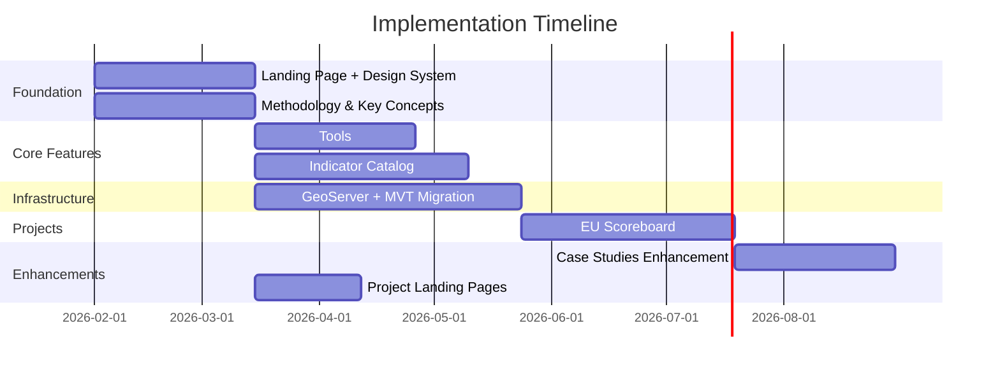
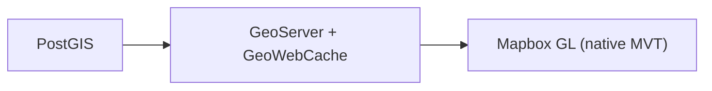
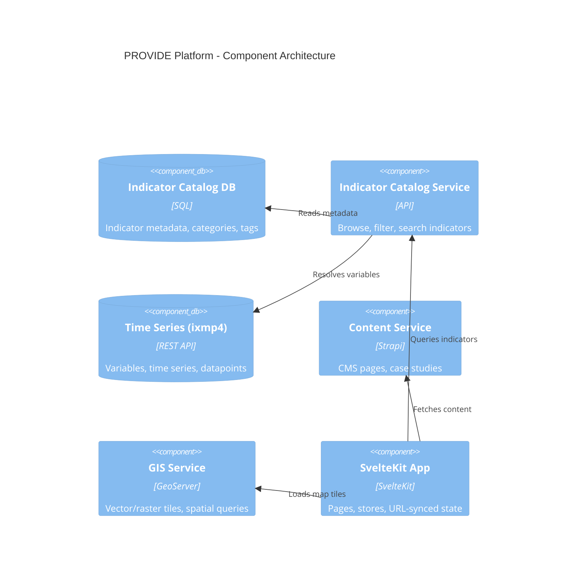
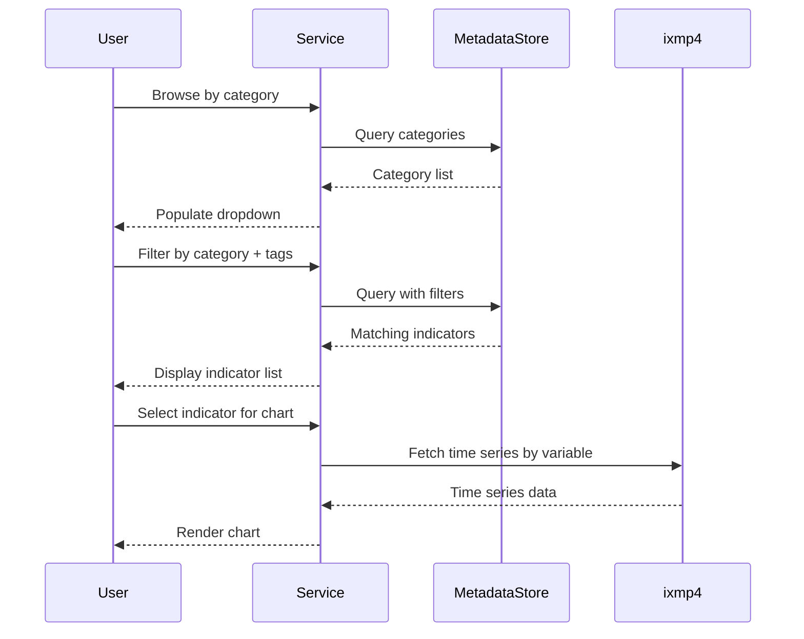
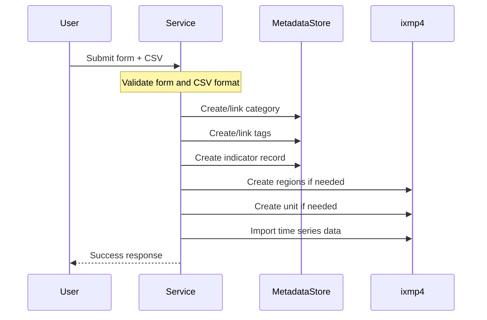

# PROVIDE Project - Technical Plan

## Current Architecture Overview

SvelteKit application with modular architecture: Svelte stores for state management, URL-synced query parameters for deep linking, and a centralized config for routes, labels, API endpoints, and per-module constraints.

### Service Architecture

| Service | Role | Technology |
|---------|------|------------|
| **Time Series** | Climate indicator data storage and querying | ixmp4 |
| **GIS** | Geographic data, vector/raster tiles, spatial queries | GeoServer + PostGIS |
| **Indicator Catalog DB** | Indicator metadata, categories, tags, filtering | Embedded SQL |
| **Content** | CMS-managed pages, case studies, tool descriptions | Strapi |

The SvelteKit frontend orchestrates across these services — for example, the Indicator Catalog combines Indicator Catalog DB queries (for browsing/filtering) with Time Series queries (for charting), while the EU Scoreboard additionally pulls geographic boundaries from the GIS service and editorial content from Strapi.

---

## Implementation Timeline

### Dependencies

| Deliverable | Depends On | Enables |
|-------------|------------|---------|
| 1. Landing Page | — | 3, 4, 5 |
| 2. Methodology & Key Concepts | — | — |
| 3. Tools | 1 | 6 |
| 4. Indicator Catalog | 1 | 6 |
| 5. GeoServer + MVT | 1 | 6 |
| 6. EU Scoreboard | 3, 4, 5 | 7 |
| 7. Case Studies | 6 | — |
| 8. Project Landing Pages | 1 | — |

---

## Landing Page + Design System

Redesign the landing page to improve discoverability and communicate the platform's purpose. Update the design system color palette for better hierarchy, accessibility, and brand consistency.

- **Mission statement** — crisp value-proposition line with supporting copy; exact wording refined with stakeholders.
- **Tool cards** — visual entry points to Avoid Future Impacts and EU Scoreboard.
- **Featured content** — editorially curated section managed via Strapi (title, description, thumbnail, link, display dates).
- **Entry points** — Explore, Avoiding Future Impacts, EU Scoreboard, Case Studies.
- **Design system** — updated color tokens, contrast ratios, and semantic colors propagated via theme store and CSS custom properties.

---

## Methodology & Key Concepts

Merge the existing Methodology and Key Concepts sections into a single browsable knowledge base with categories, search, sidebar/index navigation, in-page cross-links, and breadcrumbs.

---

## Tools

Dedicated `/tools` hub for analytical tools. First entry: "Avoiding Future Impacts" migrated from `/impacts/avoid` to `/tools/avoiding-future-impact`.

- **Strapi-managed** — "Tools" collection with slug, title, description, thumbnail, geography types, scenarios, and publication status.
- **Route structure** — grid landing page with cards; each tool gets a nested route retaining existing functionality.
- **Backward compatibility** — 301 redirect from `/impacts/avoid` preserving query parameters.
- **Navigation** — "Tools" link in site header; contextual deep-link from Future Impacts explore page when selection is compatible.

---

## Indicator Catalog

Unified system for browsing, filtering, and visualizing climate indicators. Bridges the Indicator Catalog DB service with ixmp4 for time series. See [Indicator Catalog Design](#indicator-catalog-design) for detailed design.

- **Hybrid architecture** — Indicator Catalog DB for names/descriptions/categories/tags, ixmp4 for time series, linked via `ixmp4Variable`.
- **Metadata store** — embedded SQL with type-safe ORM; no external dependencies.
- **Indicator browser** — category dropdown, tag multi-select, searchable list, detail view with chart.
- **Time series visualization** — fetches from ixmp4 by linked variable, renders region × year chart.
- **Upload** — form + CSV; validates, stores metadata, imports time series into ixmp4.

---

## GeoServer + MVT Migration

Migrate geographic data processing from client-side (GeoJSON + D3 contours + Turf.js clipping) to server-side vector tiles.

- **Target** — PostGIS stores impact data and boundaries; GeoServer serves pre-generated MVT vector tiles and raster tiles (e.g. climate/land-use grids).
- **Config** — new env vars for GeoServer URL/workspace; layer name mappings and tile URL generation.
- **Frontend** — new `VectorTileLayer` Svelte component; existing Maps component migrated from GeoJSON to MVT; D3 color scales replaced with Mapbox style expressions.
- **API utilities** — WMS GetCapabilities, WFS GetPropertyValue, WMS GetFeatureInfo.
- **Cleanup** — remove geomask web worker, coordinate-to-polygon, and contour generation; retain color scale utilities.

---

## EU Scoreboard

Comparative view of climate performance metrics across EU countries, added as a new Tool.

- **Country comparison dashboard** — side-by-side indicators with current values, trends, and projections.
- **Scenario comparison** — how different climate pathways affect country-level outcomes.
- **Data integration** — Indicator Catalog for metadata, ixmp4 for time series, GeoServer for boundaries.
- **UI (TBD)** — scoreboard landing with headline metrics and map, comparison tool with shareable URL state, choropleth maps.
- **Content** — managed through Strapi alongside other tools.

---

## Case Studies Enhancement

Enhance the adaptation case studies section with filtering and richer visualizations.

- **Filters** — category and tag controls on the landing page, reflected in URL query parameters.
- **Visualization components** — new components integrated with Strapi dynamic zones for editor-managed rich content.

---

## Project Landing Pages

Unlisted, shareable landing pages for individual PROVIDE projects. Each page has a title, short description, and CTAs linking to the relevant Explore view and Tools page. Managed via a Strapi content type with SEO metadata (title, description, Open Graph tags).

---

## Indicator Catalog Design

### Goals

- Rich metadata: name, description, category, tags, source, project, unit
- Time series with region, year, value dimensions
- Query support for dropdowns and multi-select filters
- Integration with ixmp4-ts

### Constraint

ixmp4 lacks native metadata support, necessitating a hybrid architecture with a separate Indicator Catalog DB.

### Hybrid Architecture

### ixmp4-ts Integration

Uses `platform.iamc.tabulate()` for queries and `run.iamc.add()` for uploads. The `ixmp4Variable` field bridges the Indicator Catalog DB and ixmp4.

### Data Model

**Indicator** — name, description (markdown), category (ref), tags (many), source, project, unit, ixmp4Variable (unique link).

**Category** — unique name (e.g., "Climate", "Energy", "Health").

**Tag** — unique name (e.g., "temperature", "health", "emissions").

### API Design

- **Get Categories** — all names, sorted alphabetically.
- **Get Tags** — all names, sorted alphabetically.
- **Get Indicators** — optional filters for category, tags (AND logic), and search text; returns metadata with ixmp4Variable link.
- **Get Time Series** — by ixmp4Variable with optional region/year filters; returns region, year, unit, value.

### Upload Flow

Form + CSV submission → validate → store metadata → import time series into ixmp4. Two-phase commit: if ixmp4 import fails, metadata is rolled back.

**CSV format:** three columns — region, year, value.

