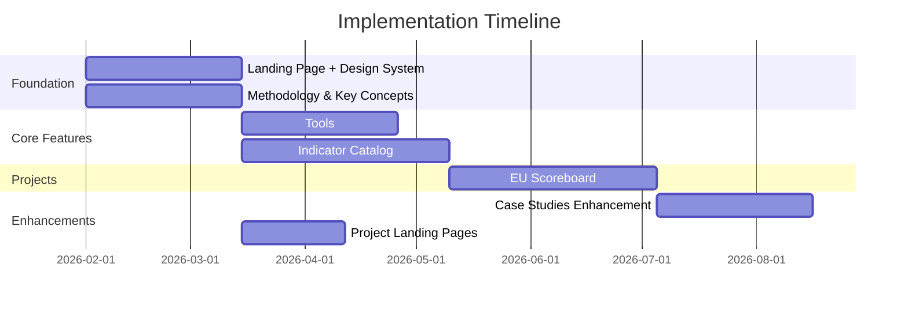
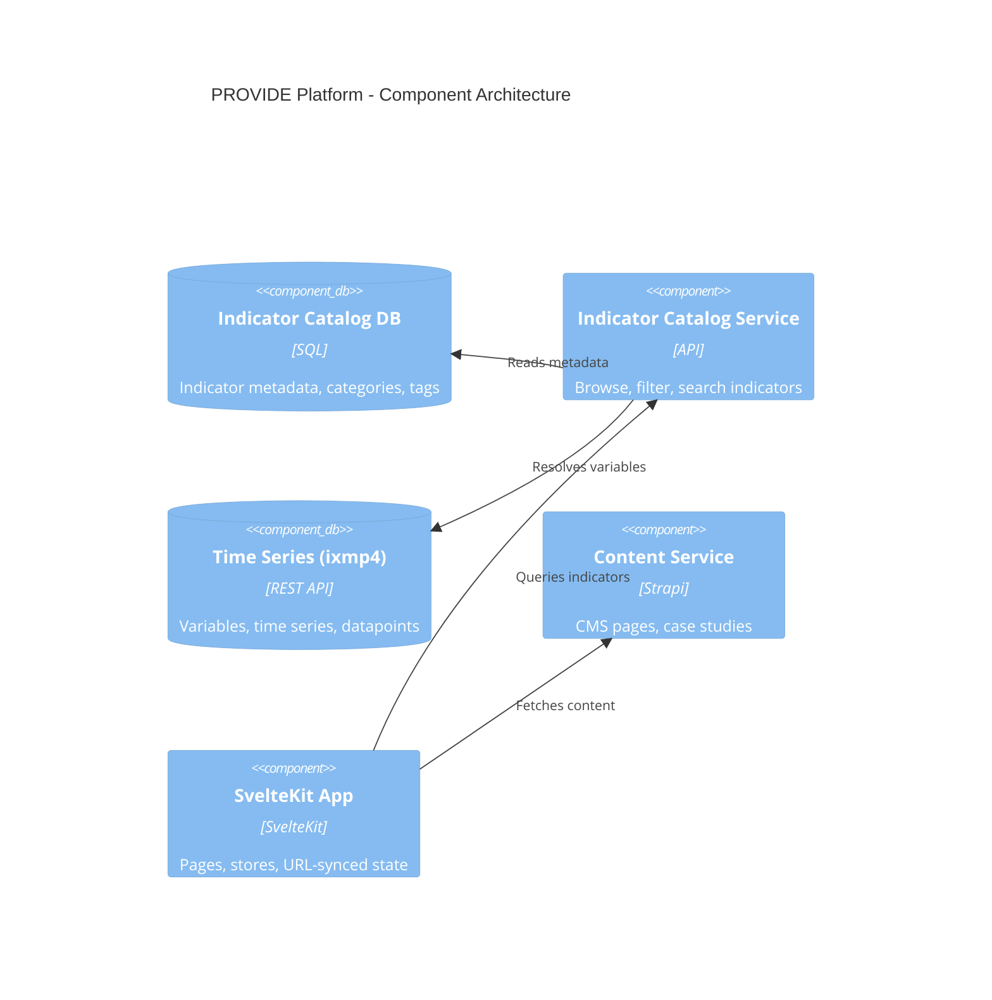
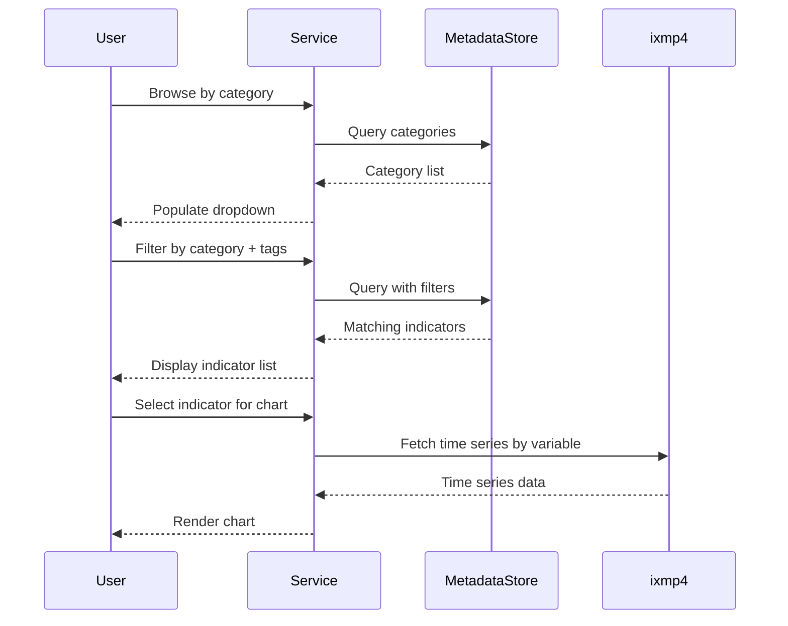
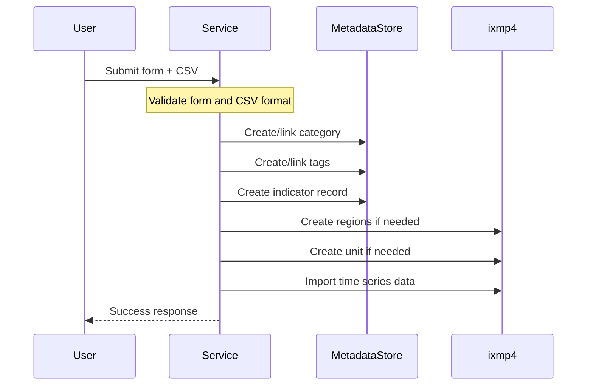

# PROVIDE Project - Technical Plan

## Current Architecture Overview

SvelteKit application with modular architecture: Svelte stores for state management, URL-synced query parameters for deep linking, and a centralized config for routes, labels, API endpoints, and per-module constraints.

### Service Architecture

| Service                  | Role                                                  | Technology          |
| ------------------------ | ----------------------------------------------------- | ------------------- |
| **Time Series**          | Climate indicator data storage and querying           | ixmp4               |
| **Indicator Catalog DB** | Indicator metadata, categories, tags, filtering       | Embedded SQL        |
| **Content**              | CMS-managed pages, case studies, tool descriptions    | Strapi              |

The SvelteKit frontend orchestrates across these services — for example, the Indicator Catalog combines Indicator Catalog DB queries (for browsing/filtering) with Time Series queries (for charting), while the EU Scoreboard additionally pulls geographic boundaries from the GIS service and editorial content from Strapi.

---

## Implementation Timeline

```mermaid
gantt
    title Implementation Timeline
    dateFormat YYYY-MM-DD

    section Foundation
    Landing Page + Design System           :d1, 2026-02-01, 6w
    Methodology & Key Concepts             :d2, 2026-02-01, 6w

    section Core Features
    Tools                             :d3, after d1, 6w
    Indicator Catalog                      :d4, after d1, 8w

    section Projects
    EU Scoreboard                          :d5, after d3 d4, 8w

    section Enhancements
    Case Studies Enhancement               :d6, after d5, 6w
    Project Landing Pages                  :d7, after d1, 4w
```

### Dependencies

| Deliverable                   | Depends On | Enables |
| ----------------------------- | ---------- | ------- |
| 1. Landing Page               | —          | 3, 4    |
| 2. Methodology & Key Concepts | —          | —       |
| 3. Tools                      | 1          | 5       |
| 4. Indicator Catalog          | 1          | 5       |
| 5. EU Scoreboard              | 3, 4       | 6       |
| 6. Case Studies               | 5          | —       |
| 7. Project Landing Pages      | 1          | —       |

---

## Landing Page + Design System

Redesign the landing page to improve discoverability and communicate the platform's purpose. Update the design system color palette for better hierarchy, accessibility, and brand consistency.

- **Mission statement** — crisp value-proposition line with supporting copy; exact wording refined with stakeholders.
- **Tool cards** — visual entry points to Avoid Future Impacts and EU Scoreboard.
- **Featured content** — editorially curated section managed via Strapi (title, description, thumbnail, link, display dates).
- **Entry points** — Explore, Avoiding Future Impacts, EU Scoreboard, Case Studies.
- **Design system** — updated color tokens, contrast ratios, and semantic colors propagated via theme store and CSS custom properties.

---

## Methodology & Key Concepts

Merge the existing Methodology and Key Concepts sections into a single browsable knowledge base with categories, search, sidebar/index navigation, in-page cross-links, and breadcrumbs.

---

## Tools

Dedicated `/adaptation` hub for analytical tools. First entry: "Avoiding Future Impacts" migrated from `/impacts/avoid` to `/adaptation/avoiding-future-impact`.

- **Strapi-managed** — "Tools" collection with slug, title, description, thumbnail, geography types, scenarios, and publication status.
- **Route structure** — grid landing page with cards; each tool gets a nested route retaining existing functionality.
- **Backward compatibility** — 301 redirect from `/impacts/avoid` preserving query parameters.
- **Navigation** — "Tools" link in site header; contextual deep-link from Future Impacts explore page when selection is compatible.

---

## Indicator Catalog

Unified system for browsing, filtering, and visualizing climate indicators. Bridges the Indicator Catalog DB service with ixmp4 for time series. See [Indicator Catalog Design](#indicator-catalog-design) for detailed design.

- **Hybrid architecture** — Indicator Catalog DB for names/descriptions/categories/tags, ixmp4 for time series, linked via `ixmp4Variable`.
- **Metadata store** — embedded SQL with type-safe ORM; no external dependencies.
- **Indicator browser** — category dropdown, tag multi-select, searchable list, detail view with chart.
- **Time series visualization** — fetches from ixmp4 by linked variable, renders region × year chart.
- **Upload** — form + CSV; validates, stores metadata, imports time series into ixmp4.

---

## EU Scoreboard

Comparative view of climate performance metrics across EU countries, added as a new Tool.

- **Country comparison dashboard** — side-by-side indicators with current values, trends, and projections.
- **Scenario comparison** — how different climate pathways affect country-level outcomes.
- **Data integration** — Indicator Catalog for metadata and ixmp4 for time series.
- **UI (TBD)** — scoreboard landing with headline metrics and map, comparison tool with shareable URL state, choropleth maps.
- **Content** — managed through Strapi alongside other tools.

### Chart component plan

The initial chart scope is LN-01, LN-02, BR-03, SC-01, and TB-01. MP-01 and its geographic data work are deferred. The shared design also makes LN-03 a low-cost configuration of LN-01; AR-01, BR-01/02/04, and SC-02 remain later extensions.

#### Shared architecture

Keep `ChartFrame` as the common widget shell for titles, descriptions, loading, metadata, and downloads. Add a shared Cartesian core for responsive sizing, scales, axes, formatting, legends, and interaction.

Each renderer accepts normalized rows plus a discriminated configuration object describing field bindings, scale and domain policies, sorting, and presentation modes. Renderers do not know about IAMC, scenarios, regions, or API response shapes. Pure adapters outside the renderer perform fetching, IAMC transformation, aggregation, and stable colour assignment.

Write configuration validation and adapter tests before or alongside implementation. Component tests cover user-visible behaviour such as readable output, tooltips, keyboard access, missing data, and resizing rather than internal SVG markup.

#### LN-01 — Multi-series line

Consolidate `CorridorChart`, the currently unused `LineTimeSeries`, and the reusable line portions of `ImpactTimeChart` into one `LineChart` renderer. Existing consumers temporarily adapt their current data shapes to the new renderer before the duplicated components are retired.

Its configuration binds x, y, and series fields and selects domain policy, colour and stroke channels, legend placement, and label mode. The renderer does not distinguish between scenario, country, or model series. LN-03 uses the same component with region as the series binding and end-of-line labels.

Tests cover irregular and missing years, automatic and explicit domains, stable colour and dash combinations, legend and direct-label modes, series limits, resizing, and keyboard-accessible values. Migrate the current `CorridorChart` consumers first, followed by the central lines in `ImpactTimeChart`.

#### LN-02 — Percentile-band line

Build `BandLineChart` as a distinct renderer sharing the line chart's Cartesian core and line primitives. Keeping it separate avoids a boolean uncertainty mode on `LineChart` while still reusing scales, axes, legends, and interaction.

The configuration binds x, central, lower, upper, and series fields. Percentile discovery and alignment happen in the adapter; the renderer validates and displays normalized bounds. It supports up to three overlapping bands, gaps, configurable opacity, and the same stable scenario colour and stroke registry as LN-01.

Tests cover incomplete or misaligned percentiles, multiple overlapping bands, gaps, invalid bounds, tooltips, and units. The current `ImpactTime` widget can use this renderer while retaining PROVIDE-specific API translation and optional GMT presentation in its wrapper.

#### BR-03 — Grouped bar

Create a new `GroupedBarChart` renderer using the shared axes, formatting, legend, and popover infrastructure. The existing unavoidable-risk bar elements are specific to that visualization and are not suitable as general bar primitives.

Its configuration binds group, series, and value fields with explicit sort mode, series order, domain policy, and limits. Start with the specification's horizontal layout to accommodate country names. Future ranked, stacked, and diverging bars become separate configuration variants sharing a common bar core.

Tests cover sorting, negative values and the zero baseline, missing series within a group, long labels, the 8-by-4 practical limit, responsive layout, and keyboard tooltips. A separate adapter performs the cross-region and cross-scenario query and returns one normalized row per bar.

#### SC-01 — Trade-off scatter

Refactor `ScatterplotWarming` into a generic `ScatterChart`. Reuse its LayerCake foundation and dot layer, but remove the hard-coded warming domains, labels, and sectors.

The configuration binds x, y, point identity, label, and optional colour grouping. Reference and quadrant lines are an explicit array, while labelling uses a mode such as `none`, `top-n`, or `hover`. SC-02 can later share the scatter core through a separate bubble configuration with a size field and legend.

The critical integration test aligns two indicators by region for the same model, scenario, and year. Renderer tests cover distinct axis units, missing coordinates, overlapping points, reference lines, label modes, responsive behaviour, and keyboard and touch interaction.

#### TB-01 — Ranked table

Build `RankedTable` as a semantic HTML widget rather than an SVG chart. It still uses `ChartFrame`, unit formatting, colour tokens, loading states, and downloads while providing the accessible lookup view that graphical charts cannot.

Its configuration defines the row identifier and label, column bindings, formats and units, default sort, search fields, and page size. Inline bars are a column presentation mode with their own domain policy. The table does not know that rows are NUTS regions or columns are IAMC variables.

Tests exercise searching for a region, resulting row order after sorting, pagination across all rows, missing values, and keyboard and screen-reader operation. Its normalized row dataset should later be reusable by MP-01 so the map and table cannot disagree.

### UNHCR dashboard reference

The chart system in `../../unhcr-dashboards/src/components/charts` is the architectural reference for the configuration pipeline: raw data passes through a pure builder that returns normalized data and a schema, then a composed renderer displays it. Its discriminated mark union, exhaustive mark rendering, reusable schema builders, faceting by composition, synchronized interactions, and container-aware tooltip positioning are patterns to adapt.

The PROVIDE implementation remains renderer-neutral rather than exposing Recharts properties. It also avoids the reference implementation's project-specific raw fields, implicit aggregation, zero-based domains, positional colours, hard-coded units, fixed dimensions, and tooltip assumptions. Faceting remains available as a later wrapper rather than expanding the initial chart scope.

The resulting flow is: IAMC adapter to normalized rows, type-specific configuration builder, validated renderer-neutral schema, and a shared Svelte/LayerCake renderer. Chart types retain distinct configuration unions while sharing Cartesian and mark primitives.

---

## Case Studies Enhancement

Enhance the adaptation case studies section with filtering and richer visualizations.

- **Filters** — category and tag controls on the landing page, reflected in URL query parameters.
- **Visualization components** — new components integrated with Strapi dynamic zones for editor-managed rich content.

---

## Project Landing Pages

Unlisted, shareable landing pages for individual PROVIDE projects. Each page has a title, short description, and CTAs linking to the relevant Explore view and Tools page. Managed via a Strapi content type with SEO metadata (title, description, Open Graph tags).

---

## Indicator Catalog Design

### Goals

- Rich metadata: name, description, category, tags, source, project, unit
- Time series with region, year, value dimensions
- Query support for dropdowns and multi-select filters
- Integration with ixmp4-ts

### Constraint

ixmp4 lacks native metadata support, necessitating a hybrid architecture with a separate Indicator Catalog DB.

### Hybrid Architecture

```mermaid
C4Component
    title PROVIDE Platform - Component Architecture

    ComponentDb(catalogDB, "Indicator Catalog DB", "SQL", "Indicator metadata, categories, tags")
    Component(catalog, "Indicator Catalog Service", "API", "Browse, filter, search indicators")
    ComponentDb(ixmp4DB, "Time Series (ixmp4)", "REST API", "Variables, time series, datapoints")
    Component(content, "Content Service", "Strapi", "CMS pages, case studies")
    Component(ui, "SvelteKit App", "SvelteKit", "Pages, stores, URL-synced state")

    Rel(ui, content, "Fetches content")
    Rel(ui, catalog, "Queries indicators")
    Rel(catalog, catalogDB, "Reads metadata")
    Rel(catalog, ixmp4DB, "Resolves variables")
```

### ixmp4-ts Integration

Uses `platform.iamc.tabulate()` for queries and `run.iamc.add()` for uploads. The `ixmp4Variable` field bridges the Indicator Catalog DB and ixmp4.

### Data Model

**Indicator** — name, description (markdown), category (ref), tags (many), source, project, unit, ixmp4Variable (unique link).

**Category** — unique name (e.g., "Climate", "Energy", "Health").

**Tag** — unique name (e.g., "temperature", "health", "emissions").

### API Design

- **Get Categories** — all names, sorted alphabetically.
- **Get Tags** — all names, sorted alphabetically.
- **Get Indicators** — optional filters for category, tags (AND logic), and search text; returns metadata with ixmp4Variable link.
- **Get Time Series** — by ixmp4Variable with optional region/year filters; returns region, year, unit, value.

```mermaid
sequenceDiagram
    participant User
    participant Service
    participant MetadataStore
    participant ixmp4

    User->>Service: Browse by category
    Service->>MetadataStore: Query categories
    MetadataStore-->>Service: Category list
    Service-->>User: Populate dropdown

    User->>Service: Filter by category + tags
    Service->>MetadataStore: Query with filters
    MetadataStore-->>Service: Matching indicators
    Service-->>User: Display indicator list

    User->>Service: Select indicator for chart
    Service->>ixmp4: Fetch time series by variable
    ixmp4-->>Service: Time series data
    Service-->>User: Render chart
```

### Upload Flow

Form + CSV submission → validate → store metadata → import time series into ixmp4. Two-phase commit: if ixmp4 import fails, metadata is rolled back.

```mermaid
sequenceDiagram
    participant User
    participant Service
    participant MetadataStore
    participant ixmp4

    User->>Service: Submit form + CSV
    Note over Service: Validate form and CSV format
    Service->>MetadataStore: Create/link category
    Service->>MetadataStore: Create/link tags
    Service->>MetadataStore: Create indicator record
    Service->>ixmp4: Create regions if needed
    Service->>ixmp4: Create unit if needed
    Service->>ixmp4: Import time series data
    Service-->>User: Success response
```

**CSV format:** three columns — region, year, value.
