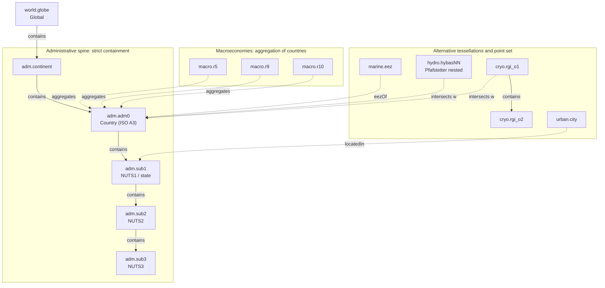

# IIASA place ontology

A generic model for the place concepts used by the PROVIDE / SPARCCLE Climate Risk Dashboard and the `scse-geojson` layers: Global, Macroeconomies, Countries, Exclusive Economic Zones, River Basins, Glacier Regions and Cities.

Version 0.2. Companion files: `place-vocab.yaml` (controlled vocabularies) and `place-feature.schema.json` (harmonised feature properties). Section "GeoServer binding" records how the model maps onto the layers served from the `native-regions` workspace.

## The core idea

The seven explorer selections are not one hierarchy. They are several independent ways of dividing or sampling the Earth that happen to coexist on the same map. The model therefore has three parts:

1. **One administrative containment spine.** Global contains continents contain countries contain subnational units. Strict nesting, so parent and child links are meaningful here.
2. **Alternative tessellations and one point set.** Maritime jurisdiction (EEZ), drainage basins, glacier regions and cities each partition or sample space on their own terms. They do not nest inside the administrative spine and mostly do not nest inside each other.
3. **Typed cross-frame relations.** Because the tessellations are incongruent, you cannot link them with parent pointers. You link them with explicit predicates, and where a value has to move from one tessellation to another you attach a weight.

Hierarchical linking is correct **within** a frame. **Across** frames you use relations, and for moving numbers you use weighted crosswalks.



Solid arrows are containment (a tree). Dotted arrows are non-containment relations. `intersects w` carries an area or population weight.

## Frames and levels

A **frame** is the top-level spatial dimension. A **level** is a granularity inside a frame. A **scheme** records the source coding system, so two layers at the same level (for example NUTS1 and a US state layer, both `adm.sub1`) can coexist. The closed lists are in `place-vocab.yaml`.

| Frame | Explorer label | Levels | Nests internally | Recommended source |
|---|---|---|---|---|
| `world` | Global | `globe` | n/a | single feature |
| `macro` | Macroeconomies | `r5`, `r9`, `r10`, (`r12`) | no | IAMC common-definitions |
| `adm` | Countries (and subnational) | `continent`, `adm0`, `sub1`, `sub2`, `sub3` | yes | Natural Earth, Eurostat NUTS, geoBoundaries |
| `marine` | Exclusive Economic Zones | `eez` | no | Marine Regions (VLIZ) |
| `hydro` | River Basins | `hybas01`..`hybas12`, `basin_major` | yes (Pfafstetter) | HydroSHEDS HydroBASINS |
| `cryo` | Glacier Regions | `rgi_o1`, `rgi_o2` | yes | Randolph Glacier Inventory |
| `urban` | Cities | `city` | no | GHS Urban Centre Database |

Macroeconomies are an aggregation, not independent geometry: each region is a dissolve of its member countries, so the authoritative truth is country membership and the polygon is derived.

## Naming scheme

Every place gets one canonical, immutable **place id (pid)** in CURIE form:

```
pid ::= prefix ":" frame "." level "." localid
```

`localid` is the most stable code published by the source authority, upper-cased, drawn from `[A-Z0-9_-]`.

| Place | pid | i_region (legacy join) |
|---|---|---|
| Global | `place:world.globe.EARTH` | Global |
| OECD & EU (R5) | `place:macro.r5.OECD_EU` | OECD & EU (R5) |
| North America (R10) | `place:macro.r10.NAM` | North America (R10) |
| Zimbabwe | `place:adm.adm0.ZWE` | Zimbabwe |
| Berlin (NUTS1) | `place:adm.sub1.DE3` | DE3 |
| Mississippi | `place:adm.sub1.US-MS` | USA\|Mississippi |
| EEZ of Portugal | `place:marine.eez.5692` | (MRGID) |
| Amazon sub-basin | `place:hydro.hybas07.7070025330` | (HYBAS_ID) |
| Alaska (RGI) | `place:cryo.rgi_o1.01` | 01 Alaska |
| Paris | `place:urban.city.Q90` | (city id) |

Rules:

1. One canonical `pid` per place, immutable. If a source code is retired, mint a successor pid and link the old one with `sameAs`; never reissue a pid.
2. `localid` comes from the source authority's most stable code. Document the authority per frame (it is the `scheme`).
3. Keep a human `name` for display and the legacy `i_region` label for IXMP4 joins. Never use a display label as the key.
4. `frame`, `level`, `scheme` and relation `predicate` are closed vocabularies. No free text.
5. Hierarchy is expressed only within a frame, via `parent_pid` plus a materialised `path` of `frame.level.localid` segments joined by `/`.
6. Cross-frame links live in the relations table with typed predicates, never as a path.
7. Version everything. `source` and `source_version` are required, plus `valid_from` / `valid_to` where a scheme revises (NUTS, RGI and EEZ all do).
8. Mark contested cases explicitly with `disputed: true` and a fallback code, rather than letting a `-99` ISO value break a join.

## Harmonised feature schema

Every feature in every layer carries the same property block so the explorer can treat all frames uniformly. Required: `pid`, `frame`, `level`, `code`, `name`, `source`, `source_version`. Hierarchy: `parent_pid`, `path`, `depth`. Crosswalk: `iso_a3`, `iso_a2`, `iso_n3`, `sovereign_iso_a3`, `wikidata_qid`. Provenance and edge cases: `valid_from`, `valid_to`, `disputed`. Full definitions and patterns are in `place-feature.schema.json`.

This is additive to `scse-geojson`. Existing columns (`I_REGION`, the Natural Earth attributes, `NUTS_ID`, `shapeISO`) stay; you add the harmonised fields alongside.

## Cross-frame relations

Edges live in a single relations table (CSV or Parquet), not in the GeoJSON properties:

```
subject_pid, predicate, object_pid, weight, weight_basis, valid_from, source
```

| Predicate | Use | Cardinality | Weighted |
|---|---|---|---|
| `contains` / `withinParent` | the spine and any nested frame | 1 parent : many children | no |
| `drainsTo` / `receives` | HydroBASINS `NEXT_DOWN` | DAG, not a tree | no |
| `aggregates` / `memberOf` | macro region to member countries | many : many | no |
| `eezOf` / `hasEEZ` | EEZ to sovereign country | many : many (joint regimes) | no |
| `intersects` | basin or glacier region to admin units | many : many | yes |
| `locatedIn` | city to admin unit | many : 1 | no |
| `sameAs` | crosswalk to an external authority (Wikidata, ISO, MRGID) | 1 : 1 | no |

## Where hierarchical linking applies, and where it does not

Use `parent_pid` and `path` (true containment trees and nesting):

- the administrative spine: Global contains continents contain countries contain `sub1`/`sub2`/`sub3`. NUTS nests by `NUTS_ID` prefix (DE then DE3 then DE30); geoBoundaries ADM1 nests within its ADM0.
- river basins: Pfafstetter nesting via `NEXT_DOWN` and `PFAF_ID` prefixes. This is a DAG of sub-basins, so use `drainsTo` for the flow graph and `contains` for the level-to-level nesting.
- glacier regions: RGI first-order contains second-order.
- macro to country: an aggregation, so `aggregates` rather than a containment path, but still a clean parent-of-members link.

Do not use containment, use a weighted `intersects` crosswalk instead:

- basin to country and glacier region to country. These cross national borders, so a basin value cannot be summed to a country without an area or population share.
- EEZ to land country. This is sovereignty (`eezOf`), not spatial containment.
- macro to basin, glacier or city. Compose through country membership plus weights rather than linking directly.
- a country to its cities. Cities sit inside a country (`locatedIn`), but they do not tile it, so you cannot partition a country value across its cities.

## Moving values between frames

This is the real job of the ontology for an IIASA delivery layer: model output is reported on `macro` and `adm0`, while impacts are shown on basins, glaciers, EEZ and cities. Two directions:

**Disaggregation (coarse to fine), for example R10 value onto river basins.** Allocate by a weight. For an extensive quantity (population exposed, GDP at risk) use a population or GDP weight; for an intensive quantity (a temperature anomaly) use area or simply inherit the parent value. The basin value is the sum over intersecting macro regions of `parent_value * intersect_weight`.

**Aggregation (fine to coarse), for example basin-level impact up to a country.** The country value is the weighted sum over basins of `basin_value * share_of_basin_in_country`, with the share from the same `intersects` edge.

Precompute these weights once per layer pairing and store them as `intersects` edges with `weight_basis`. Population weights from a gridded product (GHS-POP or WorldPop) tend to be the right default for exposure indicators; area weights for purely geometric splits.

## Migration map from the current `scse-geojson`

| Existing file | frame.level | pid pattern | parent / link |
|---|---|---|---|
| `common/world_natural-earth.geojson` | `adm.adm0` | `place:adm.adm0.<ISO_A3>` | `contains` from continent; `memberOf` macro |
| `common/r5_regions.geojson` | `macro.r5` | `place:macro.r5.<code>` | `aggregates` to `adm0` |
| `common/r9_regions.geojson` | `macro.r9` | `place:macro.r9.<code>` | `aggregates` to `adm0` |
| `common/r10_regions.geojson` | `macro.r10` | `place:macro.r10.<code>` | `aggregates` to `adm0` |
| `nuts/nuts1_regions.geojson` | `adm.sub1` (scheme `eurostat_nuts`) | `place:adm.sub1.<NUTS_ID>` | `contains` from `adm0` by `CNTR_CODE` |
| `nuts/nuts2_regions.geojson` | `adm.sub2` | `place:adm.sub2.<NUTS_ID>` | `contains` from `sub1` by prefix |
| `nuts/nuts3_regions.geojson` | `adm.sub3` | `place:adm.sub3.<NUTS_ID>` | `contains` from `sub2` by prefix |
| `usa/USA_states.geojson` | `adm.sub1` (scheme `geoboundaries_adm1`) | `place:adm.sub1.<shapeISO>` | `contains` from `place:adm.adm0.USA` |
| `utils/continents.geojson` | `adm.continent` | `place:adm.continent.<code>` | `contains` from `world.globe` |

The current `I_REGION = "USA|Mississippi"` becomes `path = adm.adm0.USA/adm.sub1.US-MS`, with the pipe value kept as an `i_region` alias for back-compat. The `(R5)` / `(R9)` / `(R10)` parenthetical tags are now carried by `frame` + `level`, so the label no longer has to encode the framework.

The EEZ, River Basin, Glacier Region and City layers are not yet in `scse-geojson`; they come from the dashboard. Confirm their exact sources and code fields against the live layers and record them under `scheme` and `source_version`.

## GeoServer binding

The layers are served from GeoServer in the `native-regions` workspace, one layer per `scse-geojson` source, as WFS (and WMS). A sample fetch of the NUTS 2 layer confirms how the model binds to what is actually published.

### What GeoServer serves today

Each feature carries the native source attributes, the geometry column `the_geom` in EPSG:4326 (lon/lat, so no axis-order surprise in the JSON output), and nothing from the harmonised schema yet. For the NUTS 2 layer the properties are `I_REGION`, `LEVL_CODE`, `CNTR_CODE`, `NAME_LATN`, `NUTS_NAME`, `MOUNT_TYPE`, `URBN_TYPE`, `COAST_TYPE`.

The key fact is that `I_REGION` is the universal IXMP4 join key but its value space is layer-specific. The harmonised `code` and `pid` are therefore derived differently per layer, which is what `scheme` records.

| Layer (scheme) | `I_REGION` holds | `code` from | `pid` |
|---|---|---|---|
| Countries (`ne_admin0`) | country name (`Zimbabwe`) | `ISO_A3` | `place:adm.adm0.<ISO_A3>` |
| NUTS 1/2/3 (`eurostat_nuts`) | NUTS code (`FRL0`) | `I_REGION` | `place:adm.sub{LEVL_CODE}.<I_REGION>` |
| US states (`geoboundaries_adm1`) | path (`USA\|Mississippi`) | `shapeISO` | `place:adm.sub1.<shapeISO>` |
| Macroeconomies (`iamc_common`) | label (`Africa (R10)`) | lookup from label | `place:macro.r{n}.<code>` |
| Continents | merged region name | slug of name | `place:adm.continent.<code>` |

Two derivations need a small lookup table held in the same schema: `CNTR_CODE` is ISO alpha-2 (`FR`) whereas the `adm0` localid is alpha-3 (`FRA`), so an `iso_lookup(iso_a2, iso_a3)` table is required to build country parents and paths; and the IAMC layers have no short-code column, so an `iamc_lookup(i_region, code)` table maps each label to its canonical short code.

### Producing the harmonised fields

Three options, in increasing separation from the source:

1. Materialise the harmonised fields as real columns in the PostGIS tables. Simplest for consumers, but duplicates derivable data and has to be rebuilt on every source refresh.
2. Expose them through a GeoServer SQL view layer that computes `pid`, `parent_pid` and `path` from `I_REGION` and `LEVL_CODE` at query time. No duplication, source stays clean. Recommended for the administrative layers because the derivations are pure string functions plus the two lookups above.
3. Compute them at ingest into the explorer's own store. Appropriate if the explorer already re-tiles or caches the data.

### Sample SQL view for the NUTS layers

A GeoServer SQL view over a NUTS table (or a single-level table; the `CASE` handles either). Set the view's feature-id column to `code` so the WFS FID is stable, and declare `the_geom` as the geometry with SRID 4326.

```sql
SELECT
  n.the_geom,
  'place:adm.sub' || n."LEVL_CODE" || '.' || n."I_REGION"        AS pid,
  'adm'                                                          AS frame,
  'sub' || n."LEVL_CODE"                                         AS level,
  'eurostat_nuts'                                                AS scheme,
  n."I_REGION"                                                   AS code,
  n."NUTS_NAME"                                                  AS name,
  n."I_REGION"                                                   AS i_region,
  n."CNTR_CODE"                                                  AS iso_a2,
  c.iso_a3                                                       AS iso_a3,
  n."LEVL_CODE"                                                  AS depth,
  CASE n."LEVL_CODE"
    WHEN 1 THEN 'place:adm.adm0.' || c.iso_a3
    ELSE 'place:adm.sub' || (n."LEVL_CODE" - 1)
         || '.' || left(n."I_REGION", n."LEVL_CODE" + 1)
  END                                                            AS parent_pid,
  'adm.adm0.' || c.iso_a3
    || case when n."LEVL_CODE" >= 1 then '/adm.sub1.' || left(n."I_REGION", 3) else '' end
    || case when n."LEVL_CODE" >= 2 then '/adm.sub2.' || left(n."I_REGION", 4) else '' end
    || case when n."LEVL_CODE" >= 3 then '/adm.sub3.' || left(n."I_REGION", 5) else '' end
                                                                 AS path,
  'Eurostat NUTS'                                                AS source,
  '2024'                                                         AS source_version,
  n."MOUNT_TYPE", n."URBN_TYPE", n."COAST_TYPE"
FROM native_regions.nuts n
LEFT JOIN native_regions.iso_lookup c ON c.iso_a2 = n."CNTR_CODE";
```

The prefix arithmetic relies on the NUTS code length being `LEVL_CODE + 2` (`FR`, `FRL`, `FRL0`, `FRL01`), so the parent at level `L-1` is `left(code, L+1)` and each path segment is a fixed-length prefix. The country layer (Natural Earth) needs its own view: `code = ISO_A3` with a fallback to `ADM0_A3` and `disputed = true` where `ISO_A3 = -99`, and `i_region` kept as the country name.

### Operational fixes to apply

- Stable feature IDs. The WFS currently returns FIDs like `NUTS 2 regions (2024 edition) v1.1.4`, which is the layer name plus a row number and is not stable across a reload or reorder. Configure the feature-id column (use `I_REGION`, or `code` in the SQL view) so the FID equals the canonical code.
- Character encoding. Served `NAME_LATN` / `NUTS_NAME` values look double-encoded (`Côte` for Côte, `Thüringen` for Thüringen, the apostrophe in `d'Azur` mangled) despite a `charset=UTF-8` header. This is the classic UTF-8 read as Latin-1 pattern, most likely from the `client_encoding` used when loading the NUTS file into PostGIS. Verify at source and reload with the correct encoding, since it corrupts every accented `name`.
- Machine-friendly layer names. Qualified names with spaces and parentheses (`NUTS 2 regions (2024 edition) v1.1`) force awkward URL encoding. Rename to the ontology style, for example `native-regions:adm_sub2_nuts_2024_v1_1`, and move the human string to the layer Title and Abstract. Same convention as the pids, applied to GeoServer.
- WFS version. 1.0.0 with JSON is fine but only offers `maxFeatures`. Use 2.0.0 if the explorer needs server-side paging (`count` and `startIndex`).
- CRS. Output is EPSG:4326; keep it as the published CRS so it matches the GeoJSON default and the explorer's web map.

## Caveats to validate

- IAMC R5, R9 and R10 each partition the country set independently. Do not assume R10 nests inside R5. If you want an R10 to R5 link, derive it from shared country membership and check it.
- Natural Earth carries `ISO_A3 = -99` for some entities (disputed or partially recognised states). Plan a fallback (`ADM0_A3` or a minted code) and set `disputed: true`, or the IXMP4 join fails silently.
- NUTS is versioned (2021 vs 2024) and boundaries move. Pin `source_version` and keep `valid_from` / `valid_to`.
- EEZ joint regimes and overlapping claims mean `eezOf` is many-to-many.
- RGI first-order regions tile the globe but are only meaningful where glaciers exist; do not present empty regions as zero risk without saying so.
