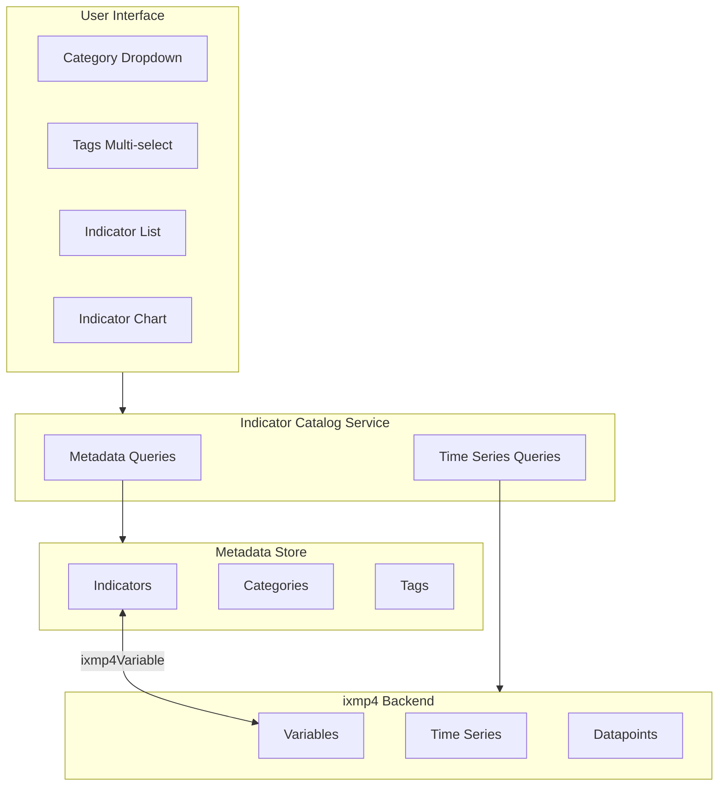
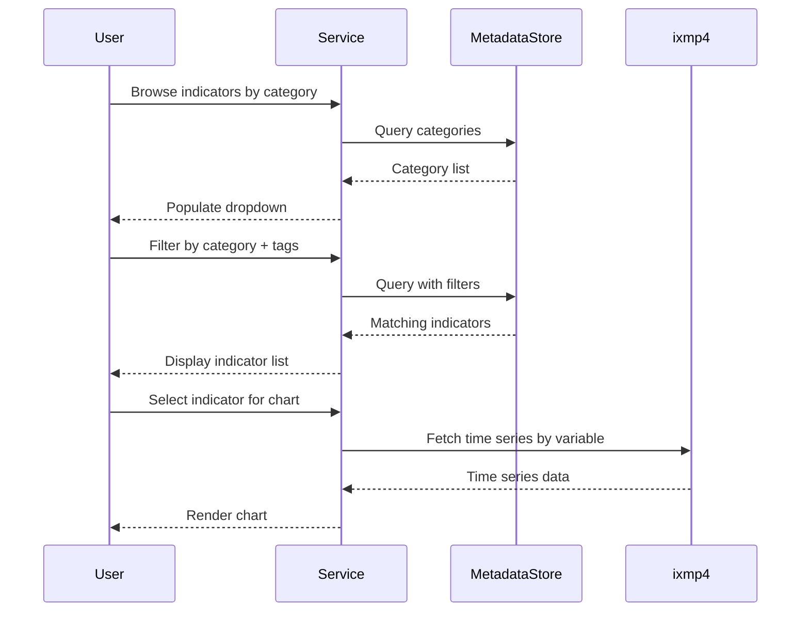
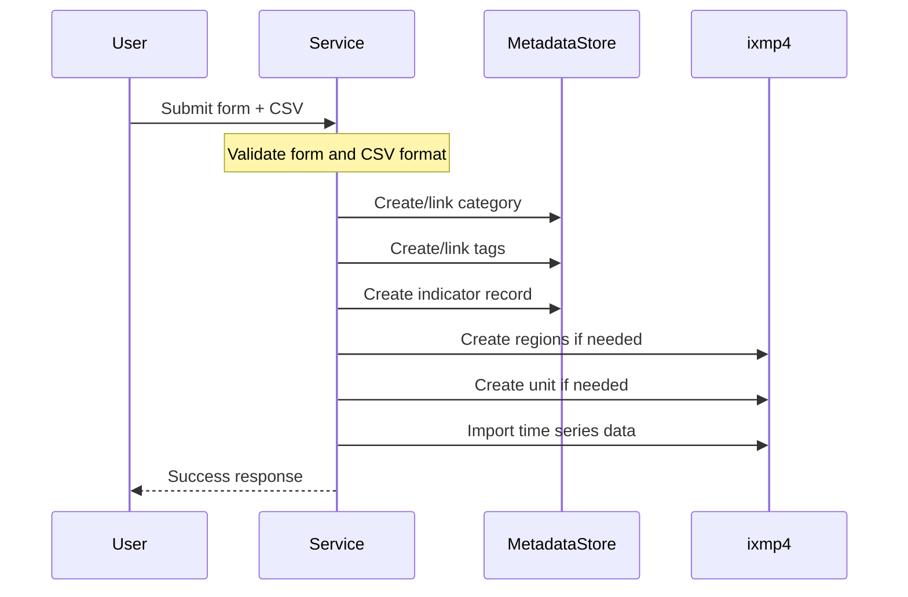

# Indicator Catalog Design

## Overview

This document outlines the design for implementing a data catalog for climate and environmental indicators within the PROVIDE application. The catalog enables rich metadata management, filtering, and time series visualization for indicators.

### Goals

- Rich metadata support including name, description, category, tags, source, project, and unit
- Time series data storage with region, year, and value dimensions
- Query capabilities for UI components such as dropdowns and multi-select filters
- Integration with ixmp4-ts for time series storage

### Constraint

The ixmp4 backend is required for time series storage but lacks native support for categories, tags, and rich metadata on variables. This necessitates a hybrid architecture with a separate metadata store.

---

## Hybrid Architecture

The solution separates concerns between metadata management and time series storage. A metadata store handles rich indicator information including categories, tags, and descriptions. The ixmp4 backend stores the actual time series data. A link field (`ixmp4Variable`) connects records in both systems, allowing the UI to query metadata for filtering and then fetch corresponding time series data.

---

## Data Model

### Indicator

The core entity representing a climate or environmental indicator with rich metadata.

| Field | Description | Required |
|-------|-------------|----------|
| name | Human-readable indicator name | Yes |
| description | Detailed description with markdown support | No |
| category | Reference to a category for classification | No |
| tags | Multiple tags for granular labeling | No |
| source | Data source (e.g., "IIASA") | No |
| project | Project name (e.g., "Climate Pathways") | No |
| unit | Measurement unit (e.g., "days/year") | Yes |
| ixmp4Variable | Link to the ixmp4 variable name | Yes (unique) |

### Category

High-level classification for organizing indicators.

| Field | Description | Required |
|-------|-------------|----------|
| name | Category name (e.g., "Climate", "Energy", "Health") | Yes (unique) |

### Tag

Granular labels that can be applied across categories for flexible filtering.

| Field | Description | Required |
|-------|-------------|----------|
| name | Tag name (e.g., "temperature", "health", "emissions") | Yes (unique) |

---

## API Design

### Query Operations

The catalog service exposes methods for querying metadata and time series data.

**Get Categories** returns a list of all category names, sorted alphabetically, for populating dropdown menus.

**Get Tags** returns a list of all tag names, sorted alphabetically, for populating multi-select filters.

**Get Indicators** accepts optional filters for category, tags, and search text. It returns indicator metadata including name, description, category, tags, and the ixmp4Variable link. When filtering by multiple tags, indicators must have all specified tags (AND logic).

**Get Time Series** takes an ixmp4Variable identifier and optional filters for region and year range. It queries the ixmp4 backend directly and returns a data frame with region, year, unit, and value columns.

### Query Flow

---

## Upload Flow

New indicators are uploaded through a form that captures metadata and a CSV file containing time series data. The upload process validates input, stores metadata in the metadata store, and imports time series data into ixmp4.

### CSV Format

The time series CSV must contain three columns: region, year, and value. Each row represents a single data point for a specific region and year.

| region | year | value |
|--------|------|-------|
| Global | 2020 | 45 |
| Global | 2021 | 52 |
| Europe | 2020 | 28 |

---

## Error Handling

The upload process uses a two-phase commit approach. Metadata is written first, followed by time series data. If the time series import fails, the metadata record is rolled back to maintain consistency between systems.

| Error Type | Response | User Message |
|------------|----------|--------------|
| Missing required fields | 400 | "Name and unit are required" |
| Invalid CSV format | 400 | "CSV must have region, year, value columns" |
| Duplicate indicator | 409 | "An indicator with this name already exists" |
| Metadata store unavailable | 503 | "Metadata service temporarily unavailable" |
| ixmp4 unavailable | 503 | "Time series service temporarily unavailable" |
| Partial failure | 500 | "Upload partially failed, please retry" |

---

## Implementation Options

Two implementation approaches are available for the metadata store, each with different trade-offs. See the detailed design documents for implementation specifics:

- **[SQLite + Drizzle](./INDICATOR_CATALOG_SQLITE.md)**: Self-contained, embedded database with type-safe ORM. Best for developer-managed data with simple deployment.

- **[Strapi CMS](./INDICATOR_CATALOG_STRAPI.md)**: External headless CMS with built-in admin UI. Best for content editor workflows and multi-user management.

### Comparison

| Aspect | SQLite + Drizzle | Strapi CMS |
|--------|------------------|------------|
| Deployment | Embedded in application | Separate service |
| Admin Interface | Drizzle Studio or custom | Built-in CMS |
| Query Performance | Local, very fast | Network latency |
| Type Safety | Full TypeScript inference | Manual types |
| Content Editors | Requires custom UI | Built-in workflows |
| Infrastructure | Single file, no hosting | Requires hosting |

---

## User Interface Components

### Indicator Browser

The main interface for exploring indicators includes a category dropdown for high-level filtering, a tag multi-select for granular filtering, a searchable indicator list with name and description, and a detail view with time series chart.

### Upload Form

The upload interface captures all metadata fields plus a CSV file picker. It validates the CSV format before submission and displays progress and error feedback during the upload process.

---

## Integration with ixmp4-ts

Time series operations use the ixmp4-ts client library. The platform connection requires authentication configuration. Queries use the `platform.iamc.tabulate()` method with variable and optional region filters. Uploads create a run and use `run.iamc.add()` to import data points.

The `ixmp4Variable` field serves as the bridge between systems. When displaying an indicator, the UI first fetches metadata from the metadata store, then uses the ixmp4Variable value to query time series data from ixmp4.
