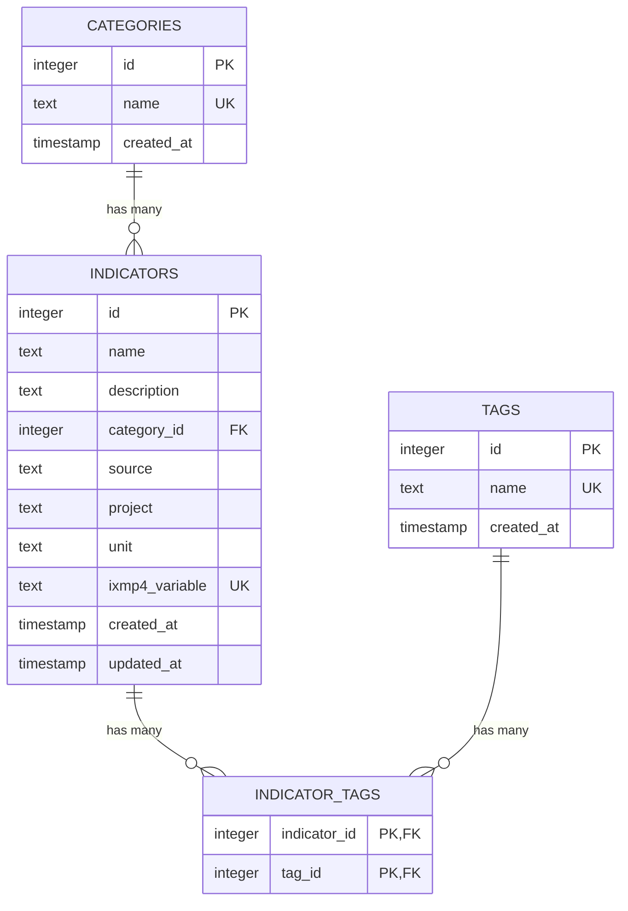
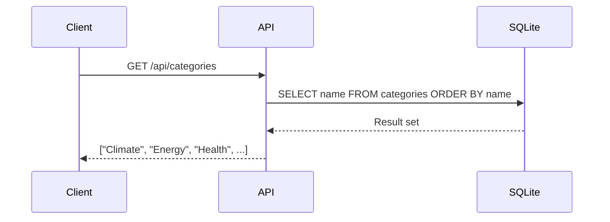
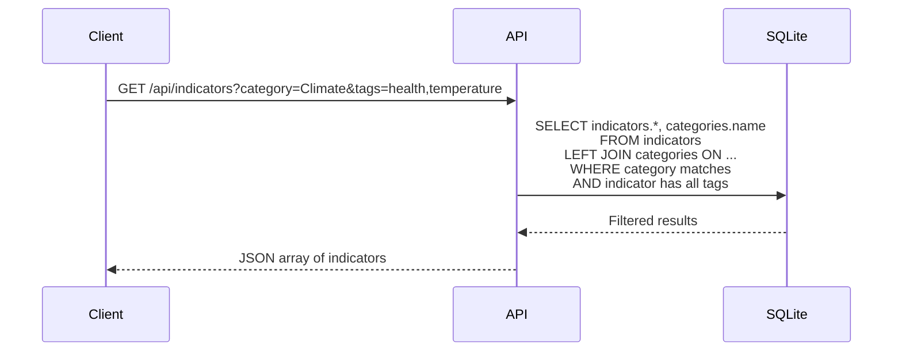
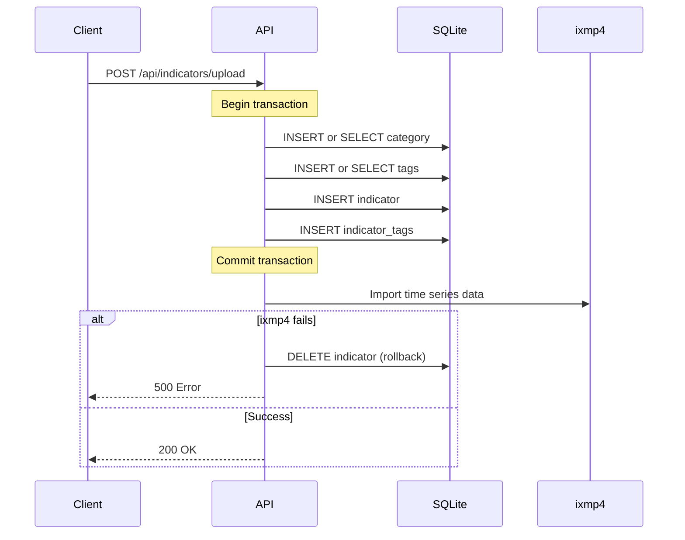

# Indicator Catalog - SQLite Implementation

This document details the SQLite + Drizzle ORM implementation for the indicator catalog metadata store. For the overall design and architecture, see [INDICATOR_CATALOG.md](./INDICATOR_CATALOG.md).

---

## Overview

This implementation uses SQLite as an embedded database with Drizzle ORM for type-safe queries. The database file is bundled with the application, eliminating external dependencies and simplifying deployment.

### Benefits

- Self-contained with no external service dependencies
- Full TypeScript type inference from schema definitions
- Very fast local queries with no network latency
- Simple backup by copying a single file
- Code-first migrations with version control

### Trade-offs

- No built-in admin UI (requires Drizzle Studio or custom interface)
- Single-file database limits horizontal scaling
- Developer-managed rather than content-editor friendly

---

## Schema Definition

### Entity Relationship Diagram



### Table Definitions

**categories**

| Field | Type | Constraints |
|-------|------|-------------|
| id | Integer | Primary key, auto-increment |
| name | Text | Unique, not null |
| created_at | Timestamp | Default now |

**tags**

| Field | Type | Constraints |
|-------|------|-------------|
| id | Integer | Primary key, auto-increment |
| name | Text | Unique, not null |
| created_at | Timestamp | Default now |

**indicators**

| Field | Type | Constraints |
|-------|------|-------------|
| id | Integer | Primary key, auto-increment |
| name | Text | Not null |
| description | Text | Nullable |
| category_id | Integer | Foreign key to categories |
| source | Text | Nullable |
| project | Text | Nullable |
| unit | Text | Not null |
| ixmp4_variable | Text | Unique, not null |
| created_at | Timestamp | Default now |
| updated_at | Timestamp | Default now, update on modify |

**indicator_tags** (Junction Table)

| Field | Type | Constraints |
|-------|------|-------------|
| indicator_id | Integer | Primary key, foreign key to indicators |
| tag_id | Integer | Primary key, foreign key to tags |

---

## API Endpoints

| Method | Endpoint | Description |
|--------|----------|-------------|
| GET | `/api/categories` | List all categories |
| GET | `/api/tags` | List all tags |
| GET | `/api/indicators` | List indicators with optional filters |
| GET | `/api/indicators/:variable` | Get single indicator by ixmp4Variable |
| GET | `/api/indicators/:variable/timeseries` | Get time series data from ixmp4 |
| POST | `/api/indicators/upload` | Upload new indicator with CSV |

---

## Query Examples

### Get Categories

Fetches all category names sorted alphabetically for dropdown population.



### Filter Indicators

Queries indicators with category and tag filters. Tag filtering uses a subquery to find indicators that have all specified tags.



---

## Upload Flow

### Transaction Handling

The upload process uses a database transaction for the metadata portion. If any step fails before ixmp4 import, the transaction rolls back automatically. If ixmp4 import fails after metadata commit, the indicator record is explicitly deleted.



---

## Dependencies

| Package | Purpose |
|---------|---------|
| drizzle-orm | Type-safe ORM for SQLite |
| better-sqlite3 | SQLite driver for Node.js |
| drizzle-kit | Migration generation and Drizzle Studio |

---

## File Structure

```
src/lib/services/indicator-catalog/
├── db/
│   ├── schema.ts          # Drizzle schema definitions
│   ├── migrations/        # Generated migrations
│   └── index.ts           # Database connection
├── repositories/
│   ├── categories.ts      # Category queries
│   ├── tags.ts            # Tag queries
│   └── indicators.ts      # Indicator queries
├── api/
│   └── +server.ts         # API route handlers
└── index.ts               # Service exports
```

---

## Development Tools

**Drizzle Studio** provides a web-based interface for browsing and editing database contents during development. It connects directly to the SQLite file and offers a spreadsheet-like experience for data management.

**Migrations** are generated from schema changes using drizzle-kit. Each migration is a SQL file that can be version controlled and applied incrementally.

---

## Deployment Considerations

The SQLite database file should be stored in a persistent location outside the application bundle for production deployments. Environment variables configure the database path.

For containerized deployments, mount a volume for the database file to persist data across container restarts.

Backups involve copying the single database file. Consider automated backup scripts for production environments.
