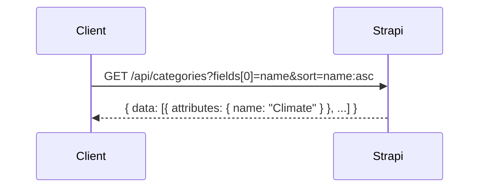
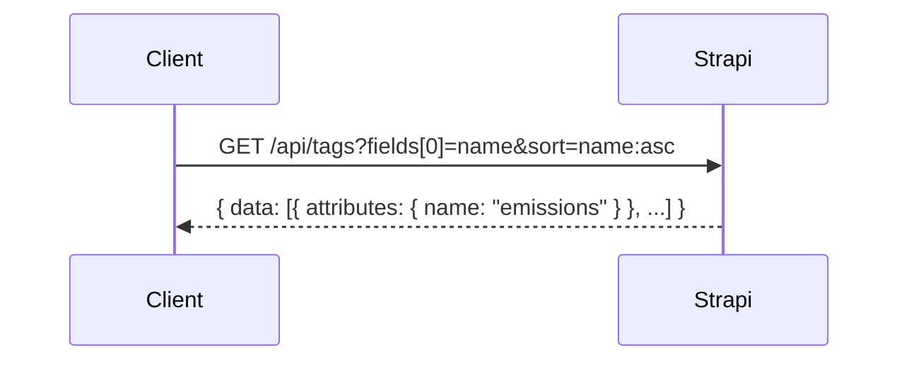
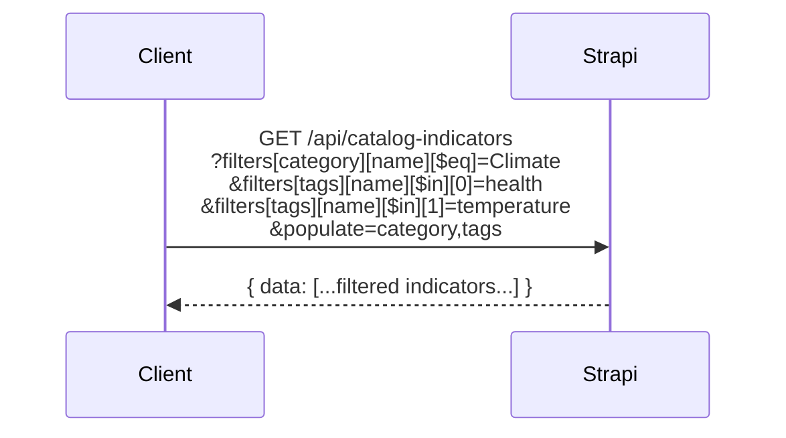
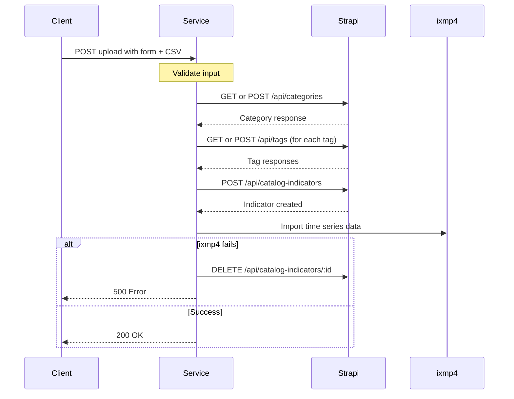

# Indicator Catalog - Strapi Implementation

This document details the Strapi CMS implementation for the indicator catalog metadata store. For the overall design and architecture, see [INDICATOR_CATALOG.md](./INDICATOR_CATALOG.md).

---

## Overview

This implementation uses Strapi as an external headless CMS for metadata storage. Strapi provides a built-in admin interface for content management, making it suitable for workflows involving content editors and non-technical users.

### Benefits

- Built-in admin UI for content management
- User roles and permissions out of the box
- Media library for thumbnails and attachments
- REST and GraphQL APIs automatically generated
- Familiar CMS workflow for content editors

### Trade-offs

- Requires separate hosting and infrastructure
- Network latency for queries
- Additional operational complexity
- Manual TypeScript type definitions

---

## Content Types

### CatalogIndicator

The main content type for indicator metadata.

| Field | Type | Description |
|-------|------|-------------|
| name | Text | Human-readable indicator name (required) |
| description | Rich Text | Detailed description with markdown |
| category | Relation | Many-to-one with Category |
| tags | Relation | Many-to-many with Tag |
| source | Text | Data source |
| project | Text | Project name |
| unit | Text | Measurement unit (required) |
| ixmp4Variable | Text | Link to ixmp4 variable (required, unique) |

### Category

| Field | Type | Description |
|-------|------|-------------|
| name | Text | Category name (required, unique) |
| indicators | Relation | One-to-many with CatalogIndicator (inverse) |

### Tag

| Field | Type | Description |
|-------|------|-------------|
| name | Text | Tag name (required, unique) |
| indicators | Relation | Many-to-many with CatalogIndicator (inverse) |

---

## API Queries

### Get Categories

Fetches category names for dropdown population.



### Get Tags

Fetches tag names for multi-select filters.



### Filter Indicators

Queries indicators with category and tag filters using Strapi's filter syntax.



---

## Upload Flow

### Sequence



---

## Integration with Existing Code

The PROVIDE application already uses Strapi for content management. The existing `loadFromStrapi()` utility function can be extended for indicator catalog queries.

### Existing Utility

The `loadFromStrapi()` function in `src/lib/utils/apis.js` handles Strapi API calls with authentication and response parsing. It accepts a path, fetch function, populate parameter, and optional query string.

### Usage for Indicators

Indicator catalog queries use the same pattern as existing Strapi integrations:

- Categories: `loadFromStrapi('categories', fetch, 'fields[0]=name', 'sort=name:asc')`
- Indicators: `loadFromStrapi('catalog-indicators', fetch, 'populate=category,tags', filters)`

---

## Admin Configuration

### Content Type Builder

Create the three content types (CatalogIndicator, Category, Tag) using Strapi's Content Type Builder. Configure relations between types and set field validations.

### Permissions

Configure public API permissions to allow:
- GET on categories, tags, and catalog-indicators
- POST on catalog-indicators (for upload, if needed from frontend)

For admin operations, use Strapi's role-based access control to manage editor permissions.

---

## Deployment

Strapi requires a Node.js hosting environment with a database. Options include:

- **Heroku**: Simple deployment with PostgreSQL addon
- **Railway/Render**: Modern PaaS with managed databases
- **Docker**: Self-hosted with PostgreSQL or SQLite

Configure environment variables for database connection, API tokens, and CORS settings to allow frontend access.

---

## Migration Considerations

### From Existing Indicators

The current system has indicators in Strapi with a `UID` field. The migration path:

1. Create new `CatalogIndicator` content type (preserve existing `Indicator` type)
2. Migrate indicators that need rich metadata and time series support
3. Generate `ixmp4Variable` identifiers from existing UIDs
4. Import corresponding time series data into ixmp4
5. Update frontend to use new catalog service

### Data Migration Script

For each existing indicator:
1. Create CatalogIndicator record with copied name and description
2. Assign category based on existing grouping logic
3. Add relevant tags based on indicator characteristics
4. Generate ixmp4Variable slug from UID or name
5. If time series data exists, import to ixmp4

---

## File Structure

```
src/lib/services/indicator-catalog/
├── types.ts               # TypeScript interfaces
├── strapi-client.ts       # Strapi API wrapper
├── repositories/
│   ├── categories.ts      # Category queries
│   ├── tags.ts            # Tag queries
│   └── indicators.ts      # Indicator queries
└── index.ts               # Service exports
```
