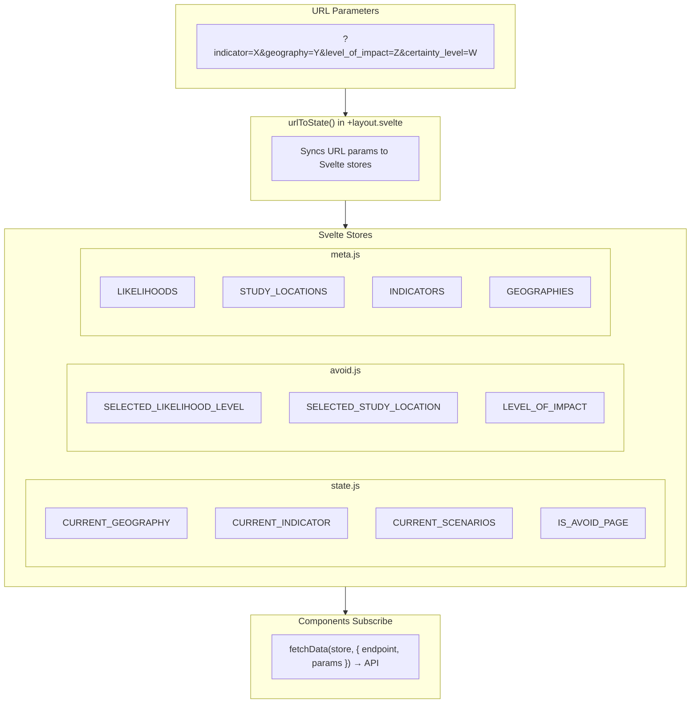
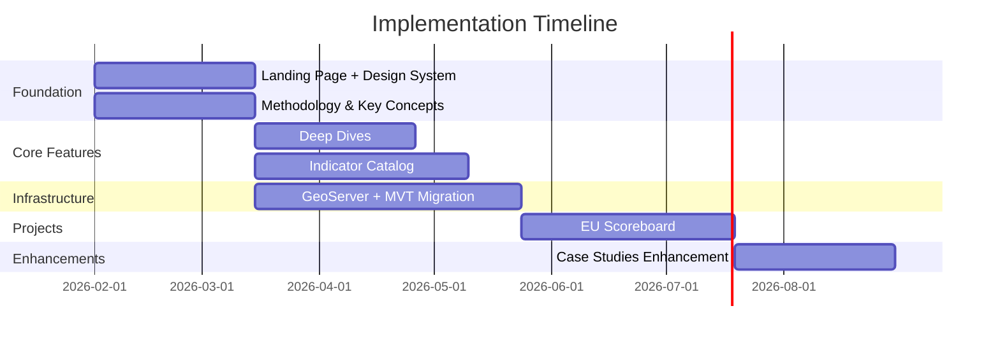
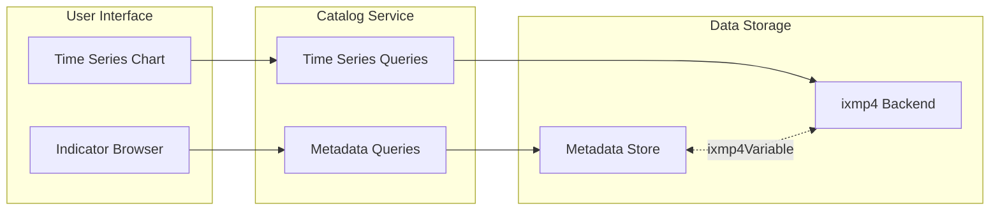
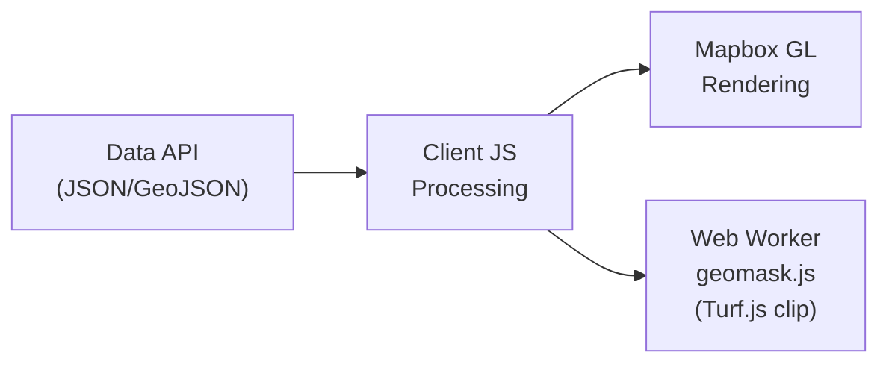
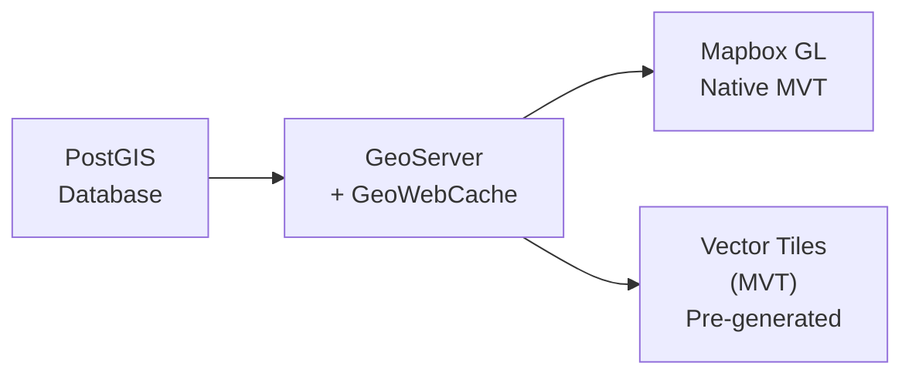

# PROVIDE Project - Technical Implementation Plan

## Table of Contents
1. [Current Architecture Overview](#1-current-architecture-overview)
2. [Implementation Timeline](#2-implementation-timeline)
3. [Deliverable 1: Landing Page + Design System](#3-deliverable-1-landing-page--design-system)
4. [Deliverable 2: Methodology & Key Concepts](#4-deliverable-2-methodology--key-concepts)
5. [Deliverable 3: Deep Dives](#5-deliverable-3-deep-dives)
6. [Deliverable 4: Indicator Catalog](#6-deliverable-4-indicator-catalog)
7. [Deliverable 5: GeoServer + MVT Migration](#7-deliverable-5-geoserver--mvt-migration)
8. [Deliverable 6: EU Scoreboard](#8-deliverable-6-eu-scoreboard)
9. [Deliverable 7: Case Studies Enhancement](#9-deliverable-7-case-studies-enhancement)

---

## 1. Current Architecture Overview

### 1.1 Application Structure

The PROVIDE application is built with SvelteKit and follows a modular architecture. The source code is organized into configuration files, Svelte stores for state management, route handlers for different pages, and a library of reusable components. The main modules include the "Avoiding Future Impacts" and "Future Impacts" explorers, case studies (adaptation), and various supporting pages like documentation and contact information.

The "Avoiding Future Impacts" module is particularly complex, featuring a reference selector for impact levels, certainty/probability selectors, study location pickers, and interactive threshold visualization components. These components work together to allow users to explore which climate scenarios minimize risk from certain impacts in cities.

### 1.2 State Management Flow

The application uses URL-based state management where query parameters are synchronized with Svelte stores. When the URL changes, the `urlToState()` function in the layout component updates the relevant stores. Components subscribe to these stores and trigger API calls when their dependencies change. This approach enables deep linking and shareable URLs while maintaining a reactive data flow throughout the application.

### 1.3 Key Configuration

The application centralizes its configuration in a dedicated config file that defines route paths, display labels, API endpoints, and constraints specific to each module. For the "Avoiding Future Impacts" feature, this includes restrictions on which geography types (currently only cities) and which scenarios are available. The config also manages localStorage keys for persisting user preferences like likelihood levels and study locations.

---

## 2. Implementation Timeline

The following Gantt chart illustrates the planned sequence and dependencies between deliverables. Deliverables 1 (Landing Page) and 2 (Methodology & Key Concepts) run in parallel as the foundation. Deliverables 3 (Deep Dives) and 4 (Indicator Catalog) can proceed in parallel after that. Deliverable 5 (GeoServer) runs concurrently as infrastructure work. Deliverable 6 (EU Scoreboard) depends on the Deep Dives, Indicator Catalog, and GeoServer being in place. Deliverable 7 (Case Studies) follows as the final enhancement.

### Dependencies

| Deliverable | Depends On | Enables |
|-------------|------------|---------|
| 1. Landing Page | — | 3, 4, 5 |
| 2. Methodology & Key Concepts | — | — |
| 3. Deep Dives | 1 | 6 |
| 4. Indicator Catalog | 1 | 6 |
| 5. GeoServer + MVT | 1 | 6 |
| 6. EU Scoreboard | 3, 4, 5 | 7 |
| 7. Case Studies | 6 | — |

---

## 3. Deliverable 1: Landing Page + Design System

### 3.1 Overview

The landing page redesign focuses on improving discoverability and clearly communicating what the tool does and how to use it. Users should immediately understand the platform's purpose and find relevant entry points for their needs. This deliverable also includes updates to the design system color palette.

### 3.2 Mission Statement

The landing page will feature a crisp mission line that establishes the platform's value proposition. A short statement such as "Thinking about the future of climate" will anchor the page, with supporting copy that explains the tool's capabilities. The exact copy will be refined with stakeholder input, but the placement and visual hierarchy will be established in this deliverable.

Each quick action will link to the most relevant tool or workflow, with brief explanatory text helping users understand what they'll find.

### 3.3 Deep Dives Cards

The landing page will showcase project and tool cards linking to specialized analytical features. These cards provide visual entry points to key areas of the platform:

- **Avoid Future Impacts** - Explore which scenarios minimize risk in cities
- **EU Scoreboard** - European climate performance metrics

### 3.4 Featured Content

An editorially curated section will spotlight timely datasets, recent case studies, or seasonal content. This "Featured" area gives editors flexibility to highlight Case studies.

Content will be managed through Strapi with fields for title, description, thumbnail, link, and display dates to support time-limited features.

### 3.5 Entry Points

Based on user research and stakeholder input, the following entry points should be prominently accessible from the landing page:

- Explore
- Avoiding future impacts (scenario comparison)
- EU Scoreboard (regional metrics)
- Case studies (real-world examples)

### 3.6 Design System Updates

The design system color palette will be updated to improve visual hierarchy, accessibility, and brand consistency. Changes will include:

- Refined primary and secondary color values
- Improved contrast ratios for accessibility compliance
- Updated semantic color tokens (success, warning, error states)
- Consistent application across all components

The theme store and CSS custom properties will be updated, with changes propagating automatically to all components using the design tokens.

### 3.7 Implementation Checklist

- Landing Page Development
- Design System

---

## 4. Deliverable 2: Methodology & Key Concepts

### 4.1 Overview

The Methodology and Key Concepts sections currently exist as separate areas of the site. This deliverable merges them into a single, unified knowledge base with improved navigation and browsing. Users will be able to discover and navigate between methodology explanations and key concept definitions through a cohesive interface.

### 4.2 Unified Structure

The merged section will combine methodology pages and key concept entries into a single browsable collection. Content will be organized with categories and a search function, allowing users to quickly find relevant explanations regardless of whether they originated as methodology or key concept content.

### 4.3 Navigation Improvements

The browsing experience will be improved with a sidebar or index view listing all entries, in-page linking between related concepts, and breadcrumb navigation for context. Entry points from other parts of the application (e.g., tooltips, info icons) will link directly to the relevant entry.

### 4.4 Implementation Checklist

- Content Audit & Merge
- Route & Navigation Setup
- Browse & Search Interface

---

## 5. Deliverable 3: Deep Dives

### 5.1 Overview

The Deep Dives will serve as a dedicated landing page for specialized analytical tools built on the PROVIDE climate data. The first project to be featured is "Avoiding Future Impacts," which will be migrated from its current location at `/impacts/avoid` to a new `/deep-dives/avoiding-future-impact` route. This reorganization creates a scalable structure for adding future tools while improving discoverability.

### 5.2 Content Management via Strapi

Deep Dives will be managed through Strapi CMS, allowing content editors to add and configure new tools without code changes. A new "Deep Dives" collection will be created with fields for slug, title, description, thumbnail, compatible geography types, available scenarios, and publication status. The hub page will fetch this data at build time, rendering only published items.

This approach provides flexibility for stakeholders to manage project metadata, update descriptions, and control visibility directly from the CMS. Project-specific settings like geography constraints and scenario availability can be configured per-item, enabling diverse analytical tools to coexist within the hub.

### 5.3 Route Structure

A new `/deep-dives` route will be created with a landing page displaying project cards in a grid layout. Each card will show a thumbnail, title, and description, linking to the project's dedicated page. The "Avoiding Future Impacts" project will have its own nested route with a custom layout that includes a back link to the hub, main controls, and project-specific introductory content.

The project page itself will retain all the functionality of the current avoid page, including the reference selector, certainty level picker, study location selector, and the threshold visualization sections. The components will be imported from their existing locations or migrated as needed.

### 5.4 Backward Compatibility

To ensure existing links and bookmarks continue to work, the original `/impacts/avoid` route will be converted to a redirect. When users visit the old URL, they will be automatically redirected to the new location with a 301 (permanent) redirect. Query parameters will be preserved during the redirect so that shared links with specific indicator and geography selections remain functional.

### 5.5 Navigation and Deep Linking

The main site header will be updated to include a "Deep Dives" link alongside the existing navigation items. Additionally, a new component will be created for the Future Impacts explore page that detects when the current selection (indicator and geography) is compatible with a deep dive and displays a contextual link inviting users to explore that tool with their current selection.

### 5.6 Implementation Checklist

- Strapi Configuration
- Route Development
- Integration

---

## 6. Deliverable 4: Indicator Catalog

### 6.1 Overview

The Indicator Catalog provides a unified system for managing climate and environmental indicators with rich metadata support. It enables users to browse, filter, and visualize indicators through category dropdowns, tag-based filtering, and time series charts. The catalog bridges metadata management with time series storage in ixmp4.

For detailed technical design, see the [Indicator Catalog Design Document](./INDICATOR_CATALOG.md).

### 6.2 Hybrid Architecture

The solution uses a hybrid approach due to ixmp4's lack of native metadata support. A separate metadata store handles indicator information including names, descriptions, categories, and tags. The ixmp4 backend stores time series data with region, year, and value dimensions. A link field (`ixmp4Variable`) connects records in both systems.

### 6.3 Metadata Store

The metadata store uses **SQL + Drizzle ORM**, providing a self-contained, embedded solution with type-safe queries and no external dependencies. Best suited for developer-managed data with simple deployment requirements. See the [Indicator Catalog - SQL Implementation](./INDICATOR_CATALOG_SQLITE.md) for details.

### 6.4 Core Features

**Indicator Browser** allows users to explore indicators through a category dropdown for high-level filtering, a tag multi-select for granular filtering, and a searchable list displaying indicator names and descriptions.

**Time Series Visualization** displays indicator data as interactive charts. When a user selects an indicator, the system fetches time series data from ixmp4 using the linked variable name and renders it with region and year dimensions.

**Upload Interface** enables adding new indicators through a form capturing metadata fields plus a CSV file containing time series data. The upload process validates input, stores metadata, and imports time series data into ixmp4.

### 6.5 Implementation Checklist

- Metadata Store Setup
- Catalog Service Development
- Frontend Components

---

## 7. Deliverable 5: GeoServer + MVT Migration

**Priority: Medium**

### 7.1 Current Data Flow

Currently, the application fetches geographic data as GeoJSON from the data API and processes it client-side. This includes converting grid coordinates to GeoJSON polygons, generating D3 contours, and applying clipping masks via a web worker using Turf.js. While this approach works, it places significant computational burden on the client and limits the ability to efficiently serve large datasets or support complex styling at multiple zoom levels.

### 7.2 Target Architecture

The migration will move geographic data processing to the server side using GeoServer with PostGIS. Impact data and boundary geometries will be stored in PostGIS and served as Mapbox Vector Tiles (MVT) through GeoServer's GeoWebCache. This enables pre-generated tiles at multiple zoom levels, dramatically reduces client-side processing, and allows Mapbox GL to render the data natively with efficient styling through expressions.

### 7.3 Environment and Configuration

The application will require new environment variables for the GeoServer URL and workspace name. The config will be extended with layer name mappings and a function to generate MVT tile URLs in the format expected by Mapbox GL. This centralized configuration ensures consistency across all components that consume vector tiles.

### 7.4 Frontend Components

A new `VectorTileLayer` Svelte component will be created to handle adding vector tile sources and layers to the Mapbox map. This component will accept props for the layer configuration, paint properties, layout settings, and filter expressions. It will manage the lifecycle of sources and layers, cleaning them up when the component is destroyed, and will reactively update paint properties and filters when props change.

The existing Maps component in the explore section will be updated to use the new VectorTileLayer component instead of the current GeoJSON-based approach. Color scales currently implemented with D3 will be converted to Mapbox style expressions that interpolate colors based on feature properties. Filters will be constructed to show only data for the currently selected scenario and year.

### 7.5 API Utilities

New utility functions will be added to the API module for interacting with GeoServer. These include fetching layer capabilities via WMS GetCapabilities, retrieving available property values via WFS GetPropertyValue, and getting feature information for clicked points via WMS GetFeatureInfo. These utilities enable the application to dynamically discover available data and provide interactive features like tooltips on hover or click.

### 7.6 Cleanup

Once the MVT migration is complete and validated, several client-side processing components can be removed. The geomask web worker will no longer be needed since clipping is handled server-side. The coordinate-to-polygon and contour generation functions in the geo utilities can be removed, though color scale utilities should be retained for other uses.

### 7.7 Implementation Checklist

- Infrastructure Setup
- Data Pipeline
- Frontend Development
- Migration & Cleanup

---

## 8. Deliverable 6: EU Scoreboard

**Priority: Medium**

### 8.1 Overview

The EU Scoreboard is a new project to be added to the Deep Dives, providing a comparative view of climate performance metrics across European countries and regions. It enables users to explore how different EU member states are performing on key climate indicators, compare trajectories, and understand regional variations in climate risk and adaptation progress.

### 8.2 Core Features

**Country Comparison Dashboard** presents key climate indicators for EU member states in a comparative format. Users can select multiple countries to compare side-by-side, with visualizations showing current values, historical trends, and projected trajectories.

**Scenario Comparison** enables users to see how different climate pathways affect country-level outcomes, helping policymakers understand the implications of various mitigation and adaptation strategies.

### 8.3 Data Integration

The EU Scoreboard will integrate with the Indicator Catalog (Deliverable 3) for metadata and with ixmp4 for time series data. Country and regional boundaries will be served via GeoServer (Deliverable 4) for map visualizations. The project will filter available indicators to those with EU coverage and aggregate data appropriately for country-level views.

### 8.4 User Interface Components (TBD)

**Scoreboard Landing** provides an overview of EU climate performance with headline metrics and a map showing the geographic distribution of key indicators. Featured insights highlight notable findings or recent changes.

**Comparison Tool** allows side-by-side comparison of selected countries across chosen indicators. Users can save and share comparison configurations via URL parameters.

**Interactive Maps** display geographic patterns using choropleth maps with the ability to toggle between different indicators and time periods.

### 8.5 Content Management

EU Scoreboard content will be managed through Strapi alongside other deep dives.

### 8.6 Implementation Checklist

- Data Preparation
- Strapi Configuration
- Route Development
- Visualization Components
- Integration

---

## 9. Deliverable 7: Case Studies Enhancement

**Priority: Medium**

### 9.1 Current Structure

The case studies section (adaptation) currently displays city-based case studies loaded from Strapi CMS. Each case study has a dedicated page with various content sections including avoiding impacts visualizations, future impacts data, image sliders, and explorer links. The landing page presents all case studies in a simple list format.

### 9.2 Filter Components

New UI components will be created for displaying categories and tags.

### 9.3 Landing Page Updates

The adaptation landing page will be enhanced with filter controls at the top, allowing users to filter case studies by category and/or tags. Filters will be reflected in the URL query parameters, enabling shareable filtered views.

### 9.4 New Visualization Components

To enrich case study content, new visualization components will be developed.

These components will be integrated with Strapi's dynamic zones feature, allowing content editors to add rich visualizations to case studies without developer intervention.

### 9.5 Implementation Checklist

- CMS Configuration
- Filter System
- Visualization Components

---

## Related Documents

- [Indicator Catalog Design](./INDICATOR_CATALOG.md) - Core architecture and data model
- [Indicator Catalog - SQL Implementation](./INDICATOR_CATALOG_SQLITE.md) - Embedded database approach
