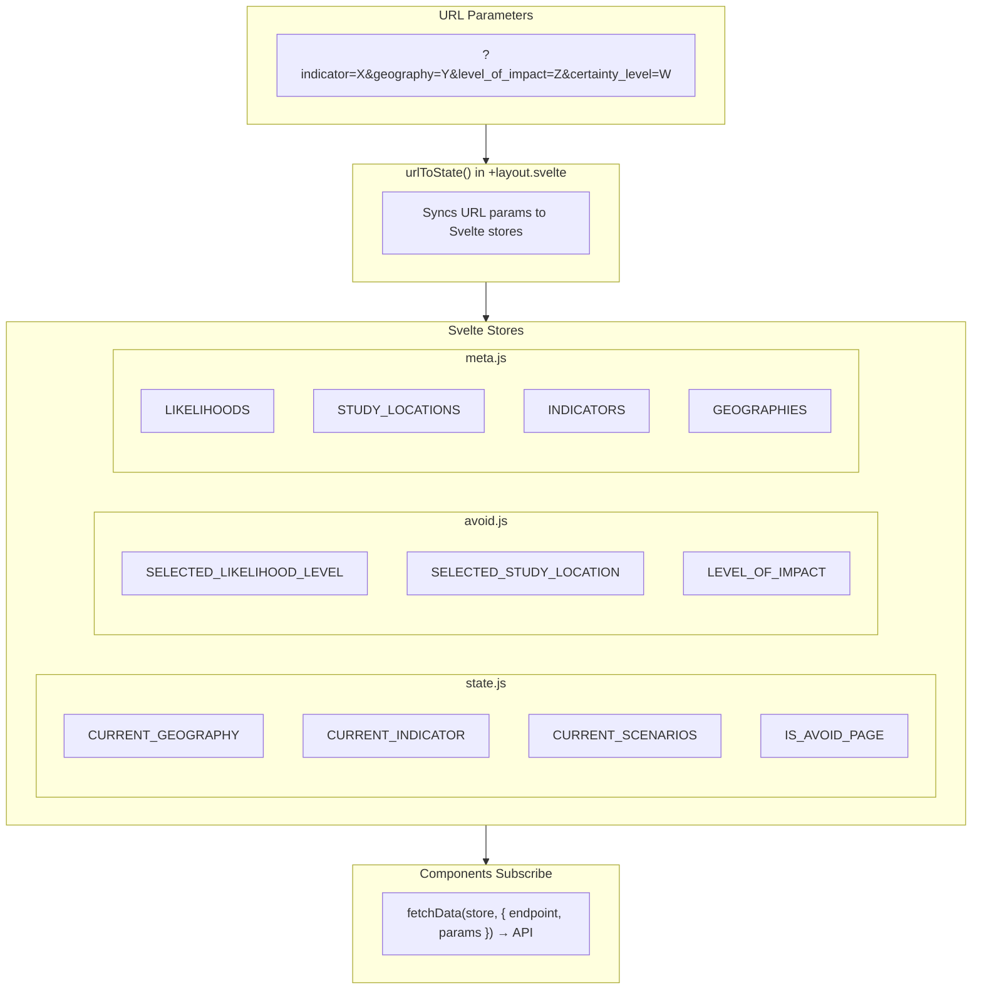
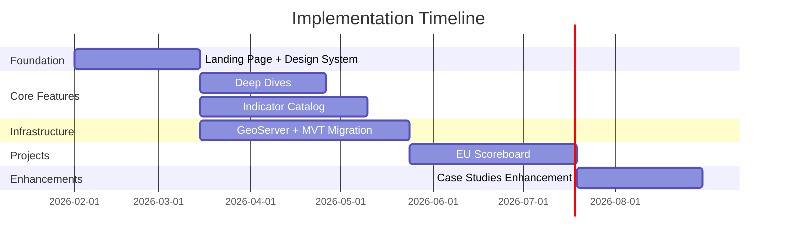
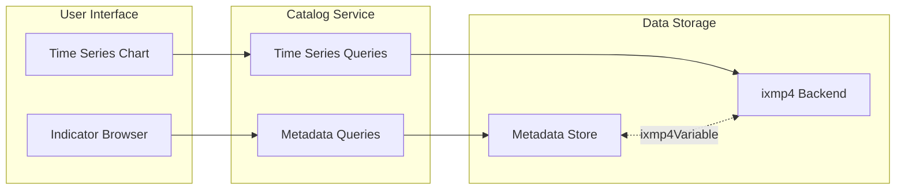
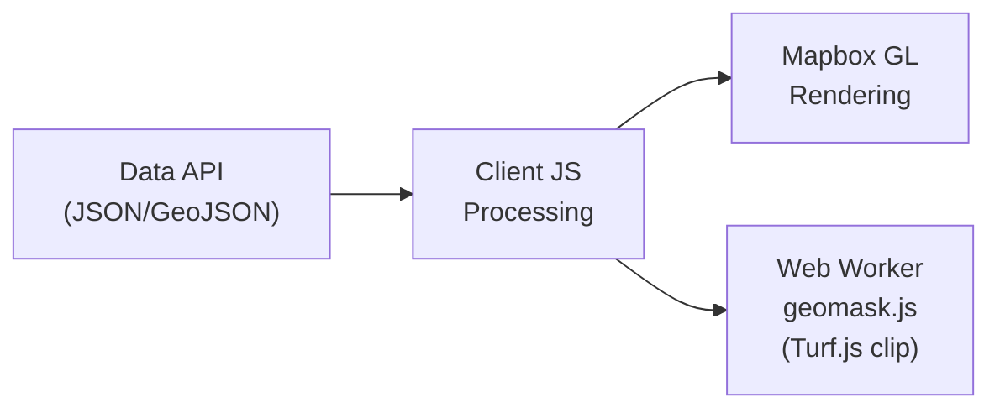
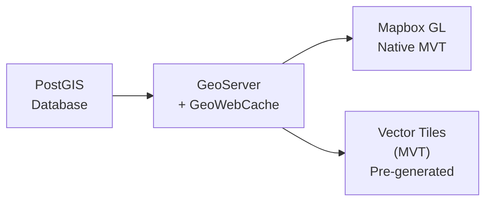

# PROVIDE Project - Technical Implementation Plan

## Table of Contents
1. [Current Architecture Overview](#1-current-architecture-overview)
2. [Implementation Timeline](#2-implementation-timeline)
3. [Deliverable 1: Landing Page + Design System](#3-deliverable-1-landing-page--design-system)
4. [Deliverable 2: Deep Dives](#4-deliverable-2-deep-dives)
5. [Deliverable 3: Indicator Catalog](#5-deliverable-3-indicator-catalog)
6. [Deliverable 4: GeoServer + MVT Migration](#6-deliverable-4-geoserver--mvt-migration)
7. [Deliverable 5: EU Scoreboard](#7-deliverable-5-eu-scoreboard)
8. [Deliverable 6: Case Studies Enhancement](#8-deliverable-6-case-studies-enhancement)
9. [Questions for Stakeholders](#9-questions-for-stakeholders)

---

## 1. Current Architecture Overview

### 1.1 Application Structure

The PROVIDE application is built with SvelteKit and follows a modular architecture. The source code is organized into configuration files, Svelte stores for state management, route handlers for different pages, and a library of reusable components. The main modules include the "Avoiding Future Impacts" and "Future Impacts" explorers, case studies (adaptation), and various supporting pages like documentation and contact information.

The "Avoiding Future Impacts" module is particularly complex, featuring a reference selector for impact levels, certainty/probability selectors, study location pickers, and interactive threshold visualization components. These components work together to allow users to explore which climate scenarios minimize risk from certain impacts in cities.

### 1.2 State Management Flow

The application uses URL-based state management where query parameters are synchronized with Svelte stores. When the URL changes, the `urlToState()` function in the layout component updates the relevant stores. Components subscribe to these stores and trigger API calls when their dependencies change. This approach enables deep linking and shareable URLs while maintaining a reactive data flow throughout the application.

### 1.3 Key Configuration

The application centralizes its configuration in a dedicated config file that defines route paths, display labels, API endpoints, and constraints specific to each module. For the "Avoiding Future Impacts" feature, this includes restrictions on which geography types (currently only cities) and which scenarios are available. The config also manages localStorage keys for persisting user preferences like likelihood levels and study locations.

---

## 2. Implementation Timeline

The following Gantt chart illustrates the planned sequence and dependencies between deliverables. Deliverable 1 (Landing Page) establishes the foundation. Deliverables 2 (Deep Dives) and 3 (Indicator Catalog) can proceed in parallel after that. Deliverable 4 (GeoServer) runs concurrently as infrastructure work. Deliverable 5 (EU Scoreboard) depends on the Deep Dives, Indicator Catalog, and GeoServer being in place. Deliverable 6 (Case Studies) follows as the final enhancement.

### Dependencies

| Deliverable | Depends On | Enables |
|-------------|------------|---------|
| 1. Landing Page | — | 2, 3, 4 |
| 2. Deep Dives | 1 | 5 |
| 3. Indicator Catalog | 1 | 5 |
| 4. GeoServer + MVT | 1 | 5 |
| 5. EU Scoreboard | 2, 3, 4 | 6 |
| 6. Case Studies | 5 | — |

---

## 3. Deliverable 1: Landing Page + Design System

**Priority: High**

### 3.1 Overview

The landing page redesign focuses on improving discoverability and clearly communicating what the tool does and how to use it. Users should immediately understand the platform's purpose and find relevant entry points for their needs. This deliverable also includes updates to the design system color palette.

### 3.2 Mission Statement

The landing page will feature a crisp mission line that establishes the platform's value proposition. A short statement such as "Thinking about the future of climate" will anchor the page, with supporting copy that explains the tool's capabilities. The exact copy will be refined with stakeholder input, but the placement and visual hierarchy will be established in this deliverable.

### 3.3 Quick Actions

A prominent section will surface quick actions that address common user intents. These action cards or buttons will use clear, task-oriented language that helps users self-identify their goals:

- **Support my report** - For users needing data to back up climate assessments
- **Compare scenarios** - For users wanting to explore different climate pathways
- **See climate projections** - For users seeking future impact visualizations
- **Assess physical risk** - For users evaluating location-specific climate risks

Each quick action will link to the most relevant tool or workflow, with brief explanatory text helping users understand what they'll find.

### 3.4 Deep Dives Cards

The landing page will showcase project and tool cards linking to specialized analytical features. These cards provide visual entry points to key areas of the platform:

- **Avoid Future Impacts** - Explore which scenarios minimize risk in cities
- **EU Scoreboard** - European climate performance metrics
- **Future Impacts Explorer** - Interactive climate projection maps
- **Urban Heat Stress** - City-level heat analysis tools

Cards will be managed through Strapi, allowing editors to control which tools are featured, update descriptions, and adjust ordering without code changes.

### 3.5 Featured Content

An editorially curated section will spotlight timely datasets, recent case studies, or seasonal content. This "Featured" area gives editors flexibility to highlight:

- New datasets as they become available
- Case studies relevant to current events or policy discussions
- Seasonal content (e.g., heat stress data during summer months)
- Recently updated tools or analyses

Content will be managed through Strapi with fields for title, description, thumbnail, link, and display dates to support time-limited features.

### 3.6 Entry Points

Based on user research and stakeholder input, the following entry points should be prominently accessible from the landing page:

- Urban heat stress analysis
- Future impacts explorer (climate projections)
- Avoiding future impacts (scenario comparison)
- EU Scoreboard (regional metrics)
- Case studies (real-world examples)
- Indicator catalog (data browser)

### 3.7 Design System Updates

The design system color palette will be updated to improve visual hierarchy, accessibility, and brand consistency. Changes will include:

- Refined primary and secondary color values
- Improved contrast ratios for accessibility compliance
- Updated semantic color tokens (success, warning, error states)
- Consistent application across all components

The theme store and CSS custom properties will be updated, with changes propagating automatically to all components using the design tokens.

### 3.8 Implementation Checklist

**Content Strategy**
- Finalize mission statement copy with stakeholders
- Define quick action labels and destinations
- Identify initial featured content items
- Plan editorial workflow for featured section

**Strapi Configuration**
- Create Featured Content collection (title, description, thumbnail, link, startDate, endDate)
- Create Quick Actions collection (label, description, icon, link, order)
- Configure Deep Dives cards as Strapi content type
- Set up preview capabilities for editors

**Landing Page Development**
- Create hero section with mission statement
- Build quick actions component with responsive grid
- Create Deep Dives card grid with Strapi integration
- Build featured content carousel or highlight section
- Implement responsive layouts for all breakpoints

**Design System**
- Audit current color usage across components
- Define updated color palette with accessibility testing
- Update theme store with new color values
- Update CSS custom properties
- Test color changes across all major components

**Quality Assurance**
- Test all quick action links and destinations
- Verify Strapi content updates reflect on landing page
- Test responsive behavior across devices
- Validate accessibility (color contrast, focus states)

---

## 4. Deliverable 2: Deep Dives

**Priority: High**

### 4.1 Overview

The Deep Dives will serve as a dedicated landing page for specialized analytical tools built on the PROVIDE climate data. The first project to be featured is "Avoiding Future Impacts," which will be migrated from its current location at `/impacts/avoid` to a new `/deep-dives/avoiding-future-impact` route. This reorganization creates a scalable structure for adding future tools while improving discoverability.

### 4.2 Content Management via Strapi

Deep Dives will be managed through Strapi CMS, allowing content editors to add and configure new tools without code changes. A new "Deep Dives" collection will be created with fields for slug, title, description, thumbnail, compatible geography types, available scenarios, and publication status. The hub page will fetch this data at build time, rendering only published items.

This approach provides flexibility for stakeholders to manage project metadata, update descriptions, and control visibility directly from the CMS. Project-specific settings like geography constraints and scenario availability can be configured per-item, enabling diverse analytical tools to coexist within the hub.

### 4.3 Route Structure

A new `/deep-dives` route will be created with a landing page displaying project cards in a grid layout. Each card will show a thumbnail, title, and description, linking to the project's dedicated page. The "Avoiding Future Impacts" project will have its own nested route with a custom layout that includes a back link to the hub, main controls, and project-specific introductory content.

The project page itself will retain all the functionality of the current avoid page, including the reference selector, certainty level picker, study location selector, and the threshold visualization sections. The components will be imported from their existing locations or migrated as needed.

### 4.4 Backward Compatibility

To ensure existing links and bookmarks continue to work, the original `/impacts/avoid` route will be converted to a redirect. When users visit the old URL, they will be automatically redirected to the new location with a 301 (permanent) redirect. Query parameters will be preserved during the redirect so that shared links with specific indicator and geography selections remain functional.

### 4.5 Navigation and Deep Linking

The main site header will be updated to include a "Deep Dives" link alongside the existing navigation items. Additionally, a new component will be created for the Future Impacts explore page that detects when the current selection (indicator and geography) is compatible with a deep dive and displays a contextual link inviting users to explore that tool with their current selection.

### 4.6 Implementation Checklist

**Strapi Configuration**
- Create Deep Dives collection with slug, title, description, thumbnail, geographyTypes, scenarios, and isPublished fields
- Add initial "Avoiding Future Impacts" entry
- Configure media upload for thumbnails

**Route Development**
- Create deep-dives hub page that fetches from Strapi
- Create avoiding-future-impact layout and page
- Implement legacy route redirect with parameter preservation

**Integration**
- Update header navigation with Deep Dives link
- Create contextual deep linking component for explore page
- Update state management to recognize new routes

**Quality Assurance**
- Test navigation flow between hub and project pages
- Verify backward compatibility redirect with query parameters
- Validate URL parameter persistence across navigation

---

## 5. Deliverable 3: Indicator Catalog

**Priority: High**

### 5.1 Overview

The Indicator Catalog provides a unified system for managing climate and environmental indicators with rich metadata support. It enables users to browse, filter, and visualize indicators through category dropdowns, tag-based filtering, and time series charts. The catalog bridges metadata management with time series storage in ixmp4.

For detailed technical design, see the [Indicator Catalog Design Document](./INDICATOR_CATALOG.md).

### 5.2 Hybrid Architecture

The solution uses a hybrid approach due to ixmp4's lack of native metadata support. A separate metadata store handles indicator information including names, descriptions, categories, and tags. The ixmp4 backend stores time series data with region, year, and value dimensions. A link field (`ixmp4Variable`) connects records in both systems.

### 5.3 Metadata Store Options

Two implementation options are available for the metadata store. The choice depends on infrastructure preferences and content management workflows.

**SQLite + Drizzle ORM** provides a self-contained, embedded solution with type-safe queries and no external dependencies. Best suited for developer-managed data with simple deployment requirements. See [SQLite Implementation](./INDICATOR_CATALOG_SQLITE.md) for details.

**Strapi CMS** provides an external headless CMS with a built-in admin interface. Best suited for workflows involving content editors and non-technical users who need to manage indicator metadata. See [Strapi Implementation](./INDICATOR_CATALOG_STRAPI.md) for details.

### 5.4 Core Features

**Indicator Browser** allows users to explore indicators through a category dropdown for high-level filtering, a tag multi-select for granular filtering, and a searchable list displaying indicator names and descriptions.

**Time Series Visualization** displays indicator data as interactive charts. When a user selects an indicator, the system fetches time series data from ixmp4 using the linked variable name and renders it with region and year dimensions.

**Upload Interface** enables adding new indicators through a form capturing metadata fields plus a CSV file containing time series data. The upload process validates input, stores metadata, and imports time series data into ixmp4.

### 5.5 Implementation Checklist

**Metadata Store Setup**
- Choose and configure metadata store (SQLite or Strapi)
- Define schema for indicators, categories, and tags
- Set up development and production environments

**Catalog Service Development**
- Create repository layer for metadata queries
- Implement category and tag listing endpoints
- Implement indicator filtering with category/tag/search support
- Integrate ixmp4-ts for time series queries

**Frontend Components**
- Create indicator browser with category dropdown and tag filter
- Create indicator list with search functionality
- Create time series chart component
- Create upload form with CSV validation

**Quality Assurance**
- Test filtering combinations
- Test time series data retrieval and chart rendering
- Test upload flow with validation errors
- Test error handling and rollback scenarios

---

## 6. Deliverable 4: GeoServer + MVT Migration

**Priority: Medium**

### 6.1 Current Data Flow

Currently, the application fetches geographic data as GeoJSON from the data API and processes it client-side. This includes converting grid coordinates to GeoJSON polygons, generating D3 contours, and applying clipping masks via a web worker using Turf.js. While this approach works, it places significant computational burden on the client and limits the ability to efficiently serve large datasets or support complex styling at multiple zoom levels.

### 6.2 Target Architecture

The migration will move geographic data processing to the server side using GeoServer with PostGIS. Impact data and boundary geometries will be stored in PostGIS and served as Mapbox Vector Tiles (MVT) through GeoServer's GeoWebCache. This enables pre-generated tiles at multiple zoom levels, dramatically reduces client-side processing, and allows Mapbox GL to render the data natively with efficient styling through expressions.

### 6.3 Environment and Configuration

The application will require new environment variables for the GeoServer URL and workspace name. The config will be extended with layer name mappings and a function to generate MVT tile URLs in the format expected by Mapbox GL. This centralized configuration ensures consistency across all components that consume vector tiles.

### 6.4 Frontend Components

A new `VectorTileLayer` Svelte component will be created to handle adding vector tile sources and layers to the Mapbox map. This component will accept props for the layer configuration, paint properties, layout settings, and filter expressions. It will manage the lifecycle of sources and layers, cleaning them up when the component is destroyed, and will reactively update paint properties and filters when props change.

The existing Maps component in the explore section will be updated to use the new VectorTileLayer component instead of the current GeoJSON-based approach. Color scales currently implemented with D3 will be converted to Mapbox style expressions that interpolate colors based on feature properties. Filters will be constructed to show only data for the currently selected scenario and year.

### 6.5 API Utilities

New utility functions will be added to the API module for interacting with GeoServer. These include fetching layer capabilities via WMS GetCapabilities, retrieving available property values via WFS GetPropertyValue, and getting feature information for clicked points via WMS GetFeatureInfo. These utilities enable the application to dynamically discover available data and provide interactive features like tooltips on hover or click.

### 6.6 Cleanup

Once the MVT migration is complete and validated, several client-side processing components can be removed. The geomask web worker will no longer be needed since clipping is handled server-side. The coordinate-to-polygon and contour generation functions in the geo utilities can be removed, though color scale utilities should be retained for other uses.

### 6.7 Implementation Checklist

**Infrastructure Setup**
- Deploy and configure GeoServer instance with GeoWebCache extension
- Set up PostGIS database connection
- Configure CORS for frontend access
- Define tile caching rules and zoom level coverage

**Data Pipeline**
- Import boundary geometries to PostGIS
- Import gridded impact data with appropriate schema
- Configure data update/refresh procedures
- Test tile generation at various zoom levels

**Frontend Development**
- Create the VectorTileLayer component
- Add GeoServer API utility functions
- Update Maps component to use vector tiles
- Convert D3 color scales to Mapbox expressions
- Implement hover and click interactions

**Migration & Cleanup**
- Conduct performance testing and comparison
- Remove deprecated client-side processing code
- Update documentation to reflect new architecture

---

## 7. Deliverable 5: EU Scoreboard

**Priority: Medium**

### 7.1 Overview

The EU Scoreboard is a new project to be added to the Deep Dives, providing a comparative view of climate performance metrics across European countries and regions. It enables users to explore how different EU member states are performing on key climate indicators, compare trajectories, and understand regional variations in climate risk and adaptation progress.

### 7.2 Core Features

**Country Comparison Dashboard** presents key climate indicators for EU member states in a comparative format. Users can select multiple countries to compare side-by-side, with visualizations showing current values, historical trends, and projected trajectories.

**Indicator Rankings** display how countries rank on specific metrics, with sortable tables and visual indicators showing relative performance. Rankings can be filtered by indicator category and time period.

**Regional Drill-Down** allows users to explore sub-national data where available, showing regional variations within countries. This helps identify local hotspots and areas of concern.

**Scenario Comparison** enables users to see how different climate pathways affect country-level outcomes, helping policymakers understand the implications of various mitigation and adaptation strategies.

### 7.3 Data Integration

The EU Scoreboard will integrate with the Indicator Catalog (Deliverable 3) for metadata and with ixmp4 for time series data. Country and regional boundaries will be served via GeoServer (Deliverable 4) for map visualizations. The project will filter available indicators to those with EU coverage and aggregate data appropriately for country-level views.

### 7.4 User Interface Components

**Scoreboard Landing** provides an overview of EU climate performance with headline metrics and a map showing the geographic distribution of key indicators. Featured insights highlight notable findings or recent changes.

**Country Profile Pages** offer detailed views for each EU member state, showing all available indicators, historical trends, and comparisons to EU averages. Each profile includes contextual information about the country's climate policies and commitments.

**Comparison Tool** allows side-by-side comparison of selected countries across chosen indicators. Users can save and share comparison configurations via URL parameters.

**Interactive Maps** display geographic patterns using choropleth maps with the ability to toggle between different indicators and time periods.

### 7.5 Content Management

EU Scoreboard content will be managed through Strapi alongside other deep dives. This includes:

- Country metadata (names, ISO codes, region groupings)
- Indicator descriptions and methodology notes
- Editorial content for insights and featured findings
- Configuration for default views and highlighted metrics

### 7.6 Implementation Checklist

**Data Preparation**
- Identify available EU-level indicators in the catalog
- Prepare country and regional boundary data for GeoServer
- Define aggregation methods for regional-to-country rollups
- Set up data validation for EU coverage

**Strapi Configuration**
- Add EU Scoreboard entry to Deep Dives collection
- Create Country collection with metadata fields
- Create Insights collection for editorial content
- Configure indicator groupings for scoreboard views

**Route Development**
- Create `/deep-dives/eu-scoreboard` landing page
- Create country profile pages with dynamic routing
- Create comparison tool interface
- Implement URL-based state for sharing configurations

**Visualization Components**
- Create country ranking table component
- Create multi-country comparison charts
- Create choropleth map component for EU data
- Create country profile summary cards

**Integration**
- Connect to Indicator Catalog for metadata
- Connect to ixmp4 for time series data
- Connect to GeoServer for boundary layers
- Implement data filtering for EU coverage

**Quality Assurance**
- Test country comparisons with various indicator combinations
- Verify data accuracy against source datasets
- Test responsive layouts for dashboard views
- Validate accessibility for data visualizations

---

## 8. Deliverable 6: Case Studies Enhancement

**Priority: Medium**

### 8.1 Current Structure

The case studies section (adaptation) currently displays city-based case studies loaded from Strapi CMS. Each case study has a dedicated page with various content sections including avoiding impacts visualizations, future impacts data, image sliders, and explorer links. The landing page presents all case studies in a simple list format.

### 8.2 Strapi Schema Enhancements

Two new collections will be added to Strapi: categories and tags. Categories provide high-level classification (e.g., "Flooding", "Heat Stress", "Infrastructure") with optional color coding for visual distinction. Tags offer more granular topic labeling that can be applied across categories. Both collections will have many-to-many relationships with case studies, allowing flexible organization and filtering.

The existing case study collection will be extended with relations to these new collections and a publishedAt field for tracking when studies are published. This enables both categorical browsing and chronological sorting.

### 8.3 Filter Components

New UI components will be created for displaying categories and tags. Category badges will be styled with the category's color and can function as both labels and clickable filters. Tag chips will have a more subtle style with visual feedback when selected. These components will be used both on case study cards and in the filter interface.

### 8.4 Landing Page Updates

The adaptation landing page will be enhanced with filter controls at the top, allowing users to filter case studies by category and/or tags. Filters will be reflected in the URL query parameters, enabling shareable filtered views. A new "Recent Case Studies" section will highlight the most recently published or updated studies in a featured grid layout, providing quick access to new content.

The server-side data loading will be updated to fetch categories and tags alongside case studies, apply any active filters from URL parameters, and sort results by date. The page component will handle filter toggle interactions and URL updates using SvelteKit's navigation functions.

### 8.5 New Visualization Components

To enrich case study content, several new visualization components will be developed. A DataTable component will display tabular data with optional sorting capabilities. StatCards will present key metrics in a grid of highlighted cards with optional trend indicators. A Timeline component will show chronological events or milestones. A ComparisonChart component will render bar or line charts for comparing values across categories. An EmbedMap component will allow embedding external map views with proper attribution.

These components will be integrated with Strapi's dynamic zones feature, allowing content editors to add rich visualizations to case studies without developer intervention.

### 8.6 Implementation Checklist

**CMS Configuration**
- Create categories collection with name, slug, description, and color fields
- Create tags collection with name and slug fields
- Add category and tag relations to case study content type
- Ensure publishedAt field is available and populated
- Create visualization component schemas in Strapi

**Filter System**
- Create CategoryBadge and TagChip UI components
- Update landing page to fetch and apply filters
- Implement filter toggle handlers with URL synchronization
- Add Recent Case Studies section with date-based sorting

**Visualization Components**
- Create DataTable component with optional sorting
- Create StatCards component for metrics display
- Create Timeline component for chronological events
- Create ComparisonChart component using existing chart library
- Create EmbedMap component for external map integration
- Add server-side handlers for new Strapi component types

---

## 9. Questions for Stakeholders

### Landing Page + Design System
1. What mission statement best captures the platform's purpose?
2. Which quick actions are most important for users?
3. What content should be initially featured?
4. Are there brand guidelines for the color palette update?

### Deep Dives
1. What projects are planned beyond "Avoiding Future Impacts" and "EU Scoreboard"?
2. Should deep dives have their own navigation submenu?
3. Any specific design requirements for project cards?

### Indicator Catalog
1. Which metadata store approach is preferred (SQLite or Strapi)?
2. What categories and tags should be pre-defined?
3. Who will be responsible for managing indicator metadata?
4. What is the expected volume of indicators?

### GeoServer Migration
1. Is there an existing GeoServer instance available?
2. What hosting environment will be used?
3. What is the expected data update frequency?
4. What zoom levels are required for vector tiles?

### EU Scoreboard
1. Which indicators should be prioritized for the initial release?
2. What country groupings are relevant (EU27, EEA, candidate countries)?
3. Should sub-national regional data be included in the first version?
4. What editorial content or insights should accompany the data?

### Case Studies
1. Which visualization components should be prioritized?
2. What category/topic taxonomy should be pre-defined?
3. Should "Recent" show by creation date or last update date?
4. Expected maximum number of case studies (pagination needs)?

---

## Related Documents

- [Indicator Catalog Design](./INDICATOR_CATALOG.md) - Core architecture and data model
- [Indicator Catalog - SQLite Implementation](./INDICATOR_CATALOG_SQLITE.md) - Embedded database approach
- [Indicator Catalog - Strapi Implementation](./INDICATOR_CATALOG_STRAPI.md) - Headless CMS approach
